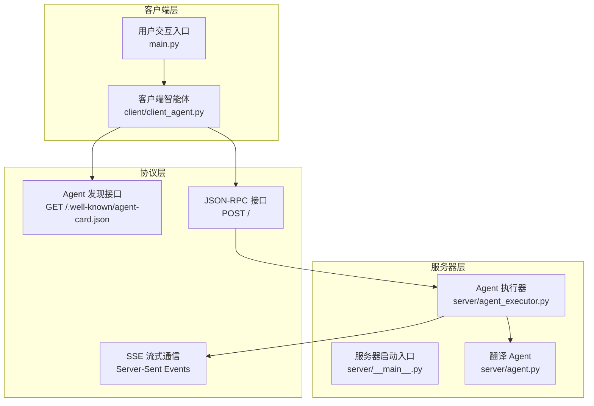
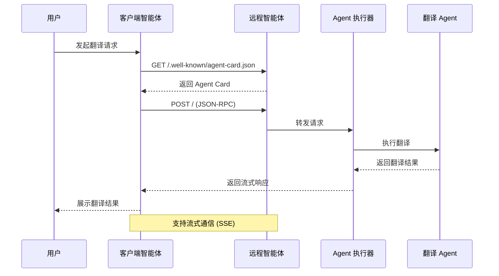
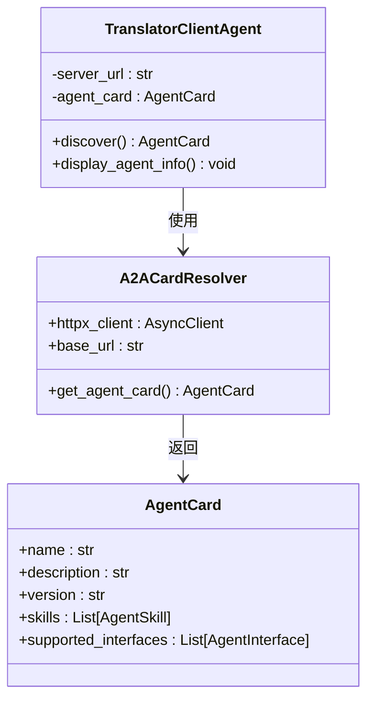
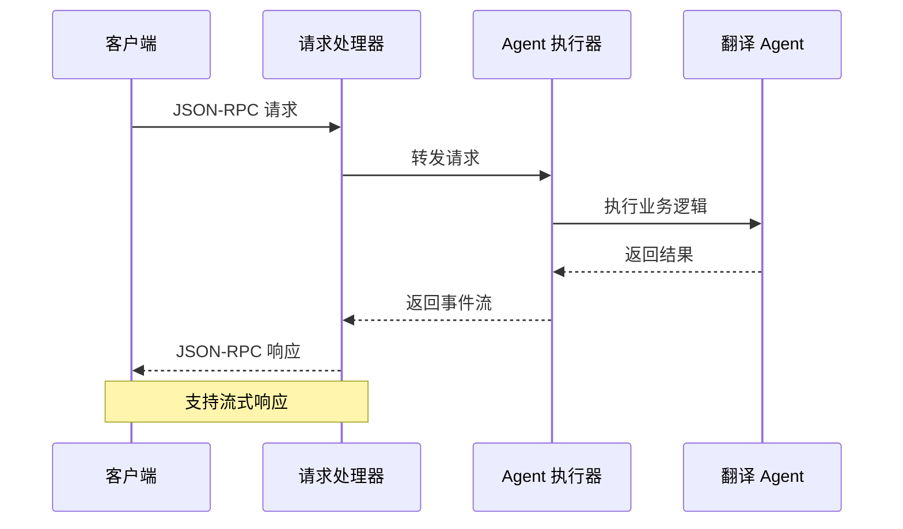
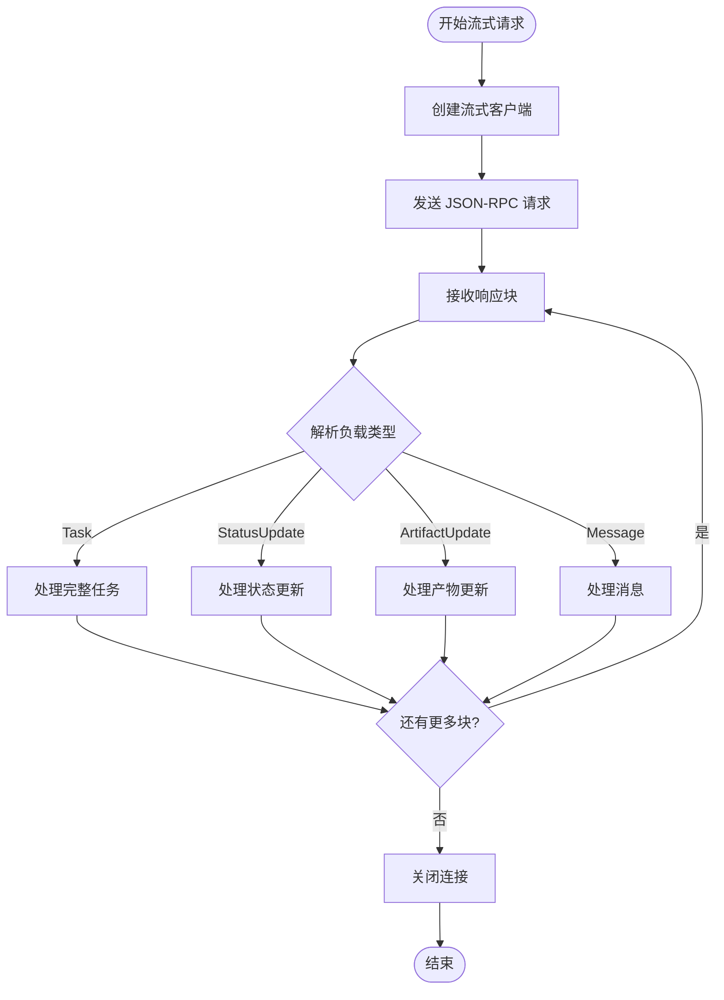
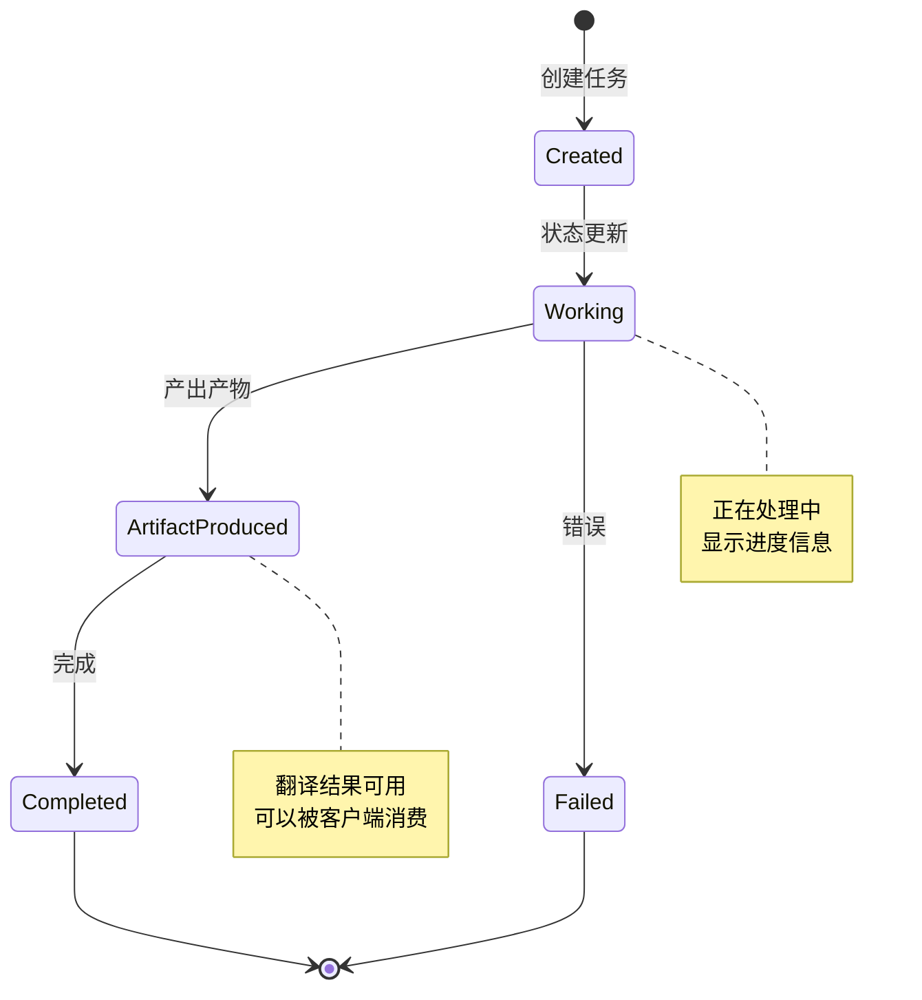
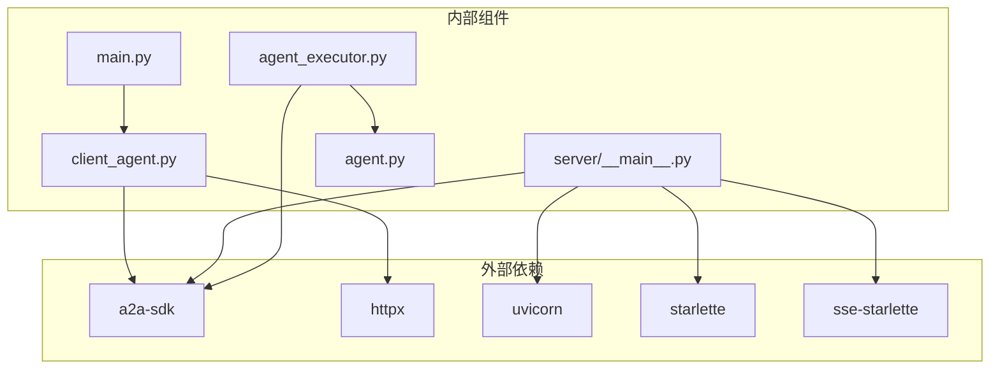

# API 接口文档

<cite>
**本文档引用的文件**
- [main.py](file://main.py)
- [server/__main__.py](file://server/__main__.py)
- [server/agent_executor.py](file://server/agent_executor.py)
- [server/agent.py](file://server/agent.py)
- [client/client_agent.py](file://client/client_agent.py)
- [README.md](file://README.md)
- [requirements.txt](file://requirements.txt)
</cite>

## 目录
1. [简介](#简介)
2. [项目结构](#项目结构)
3. [核心组件](#核心组件)
4. [架构概览](#架构概览)
5. [详细组件分析](#详细组件分析)
6. [依赖关系分析](#依赖关系分析)
7. [性能考虑](#性能考虑)
8. [故障排除指南](#故障排除指南)
9. [结论](#结论)
10. [附录](#附录)

## 简介

本项目是一个基于 A2A (Agent2Agent) 协议的完整教程演示，展示了三个核心角色之间的闭环交互流程：用户、客户端智能体和远程智能体。该系统实现了标准的 Agent 发现接口和翻译请求接口，采用 JSON-RPC 协议进行通信，并支持流式通信的 SSE 协议实现。

A2A 协议是由 Google Cloud 发起的开放协议，旨在让不同 AI Agent 之间实现标准化通信与协作。本项目通过实际的代码实现，为开发者提供了理解 A2A 协议工作原理的完整参考。

## 项目结构

该项目采用清晰的分层架构设计，主要包含以下模块：

**图表来源**
- [main.py:43-180](file://main.py#L43-L180)
- [server/__main__.py:83-171](file://server/__main__.py#L83-L171)
- [client/client_agent.py:30-274](file://client/client_agent.py#L30-L274)

**章节来源**
- [README.md:28-43](file://README.md#L28-L43)
- [requirements.txt:1-7](file://requirements.txt#L1-L7)

## 核心组件

### Agent 发现接口

Agent 发现接口是 A2A 协议交互的第一步，客户端通过该接口获取远程 Agent 的元信息。

**接口规范**
- **方法**: GET
- **路径**: `/.well-known/agent-card.json`
- **作用**: 返回 Agent 的名片信息，包含能力声明、支持的接口等元数据

### 翻译请求接口

翻译请求接口处理用户的翻译请求，支持两种模式：非流式和流式。

**接口规范**
- **方法**: POST
- **路径**: `/`
- **协议**: JSON-RPC 2.0
- **作用**: 处理翻译请求，返回翻译结果

**章节来源**
- [server/__main__.py:136-141](file://server/__main__.py#L136-L141)
- [client/client_agent.py:50-79](file://client/client_agent.py#L50-L79)

## 架构概览

系统采用客户端-服务器架构，通过 A2A 协议实现智能体间的标准化通信：

**图表来源**
- [main.py:67-164](file://main.py#L67-L164)
- [server/__main__.py:136-141](file://server/__main__.py#L136-L141)
- [client/client_agent.py:81-184](file://client/client_agent.py#L81-L184)

## 详细组件分析

### Agent 发现接口实现

Agent 发现接口通过 `A2ACardResolver` 实现，负责从远程服务器获取 Agent 的名片信息。

**图表来源**
- [client/client_agent.py:50-79](file://client/client_agent.py#L50-L79)
- [client/client_agent.py:186-204](file://client/client_agent.py#L186-L204)

**实现要点**:
- 使用 `httpx.AsyncClient` 进行异步 HTTP 请求
- 通过 `A2ACardResolver` 解析 Agent Card
- 支持多种接口协议绑定
- 包含详细的日志记录

**章节来源**
- [client/client_agent.py:50-79](file://client/client_agent.py#L50-L79)
- [client/client_agent.py:186-204](file://client/client_agent.py#L186-L204)

### JSON-RPC 协议实现

JSON-RPC 接口实现了标准的远程过程调用协议，支持方法调用和参数传递。

**图表来源**
- [server/__main__.py:127-131](file://server/__main__.py#L127-L131)
- [server/agent_executor.py:45-161](file://server/agent_executor.py#L45-L161)

**JSON-RPC 请求格式**:
- **方法**: `sendMessage`
- **参数**: `SendMessageRequest`
- **响应**: 流式响应对象

**章节来源**
- [server/__main__.py:127-131](file://server/__main__.py#L127-L131)
- [server/agent_executor.py:45-161](file://server/agent_executor.py#L45-L161)

### 流式通信 (SSE) 实现

系统支持基于 Server-Sent Events 的流式通信，实现近实时的数据传输。

**图表来源**
- [client/client_agent.py:137-184](file://client/client_agent.py#L137-L184)
- [client/client_agent.py:218-274](file://client/client_agent.py#L218-L274)

**流式响应类型**:
- `task`: 完整的任务对象
- `status_update`: 任务状态更新事件
- `artifact_update`: 产物更新事件
- `message`: 消息对象

**章节来源**
- [client/client_agent.py:137-184](file://client/client_agent.py#L137-L184)
- [client/client_agent.py:218-274](file://client/client_agent.py#L218-L274)

### 任务生命周期管理

系统实现了完整的任务生命周期管理，包括任务创建、状态更新和结果返回。

**图表来源**
- [server/agent_executor.py:74-161](file://server/agent_executor.py#L74-L161)

**任务状态流转**:
1. **Created**: 任务创建
2. **Working**: 处理中状态更新
3. **ArtifactProduced**: 产物生成
4. **Completed**: 任务完成
5. **Failed**: 任务失败

**章节来源**
- [server/agent_executor.py:74-161](file://server/agent_executor.py#L74-L161)

## 依赖关系分析

系统的依赖关系清晰明确，各组件职责分离：

**图表来源**
- [requirements.txt:1-7](file://requirements.txt#L1-L7)
- [main.py:16-20](file://main.py#L16-L20)
- [server/__main__.py:22-34](file://server/__main__.py#L22-L34)

**依赖特性**:
- **a2a-sdk**: 提供 A2A 协议核心功能
- **httpx**: 异步 HTTP 客户端
- **uvicorn**: ASGI 服务器
- **starlette**: Web 框架
- **sse-starlette**: SSE 支持

**章节来源**
- [requirements.txt:1-7](file://requirements.txt#L1-L7)

## 性能考虑

### 并发处理
- 使用异步编程模型提高并发性能
- 流式通信支持实时数据传输
- 内存任务存储优化性能

### 网络优化
- HTTP/2 支持提升连接效率
- 连接池复用减少连接开销
- 压缩传输减少带宽占用

### 缓存策略
- Agent Card 缓存减少重复获取
- 任务状态缓存提升响应速度
- 结果缓存支持快速查询

## 故障排除指南

### 常见问题及解决方案

**Agent 发现失败**
- 检查服务器是否正常启动
- 验证网络连接和防火墙设置
- 确认端口 9999 是否被占用

**JSON-RPC 请求超时**
- 检查服务器负载情况
- 验证请求格式是否正确
- 查看服务器日志获取详细错误信息

**流式通信中断**
- 检查网络连接稳定性
- 验证客户端 SSE 支持
- 查看服务器事件队列状态

**章节来源**
- [main.py:73-79](file://main.py#L73-L79)
- [server/__main__.py:44-80](file://server/__main__.py#L44-L80)

## 结论

本项目成功实现了基于 A2A 协议的完整 API 接口体系，包括：

1. **标准的 Agent 发现接口** - 通过 `/.well-known/agent-card.json` 提供 Agent 元信息
2. **完整的 JSON-RPC 接口** - 支持翻译请求的非流式和流式处理
3. **流式通信支持** - 基于 SSE 协议实现实时数据传输
4. **完善的任务管理** - 支持任务生命周期的完整管理

该实现为开发者提供了理解 A2A 协议工作原理的完整参考，具有良好的可扩展性和实用性。

## 附录

### 接口版本管理

**版本控制策略**:
- Agent Card 包含明确的版本信息
- 支持向后兼容的接口演进
- 通过版本号管理 API 变更

**兼容性说明**:
- 新版本保持旧接口可用
- 建议客户端检查 Agent Card 版本
- 提供版本迁移指南

### 最佳实践

**客户端开发建议**:
- 实现重试机制处理网络异常
- 缓存 Agent Card 减少请求频率
- 使用流式接口提升用户体验
- 实现优雅降级处理服务不可用

**服务器开发建议**:
- 实现请求限流防止滥用
- 添加监控和日志记录
- 支持健康检查接口
- 实现优雅关闭机制

**章节来源**
- [server/__main__.py:105-119](file://server/__main__.py#L105-L119)
- [README.md:81-107](file://README.md#L81-L107)