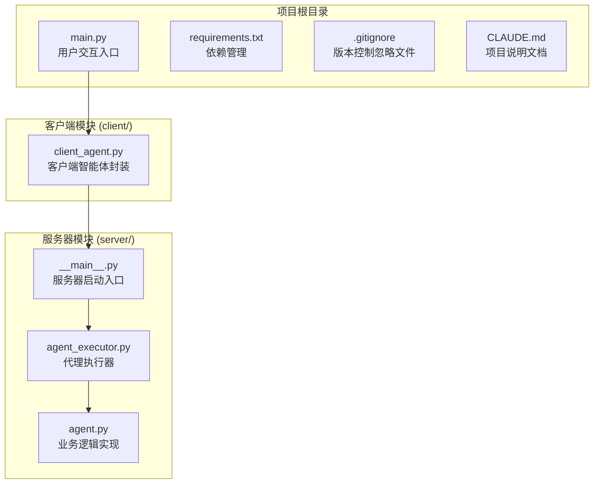
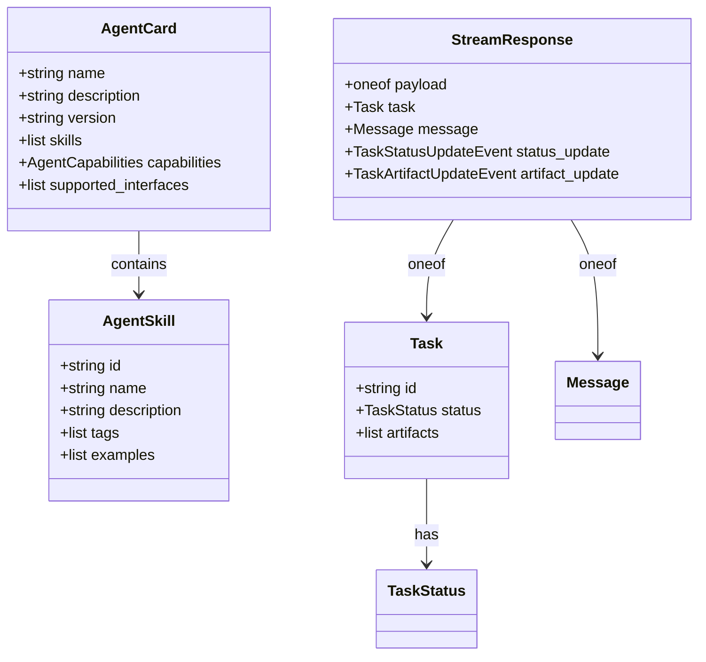
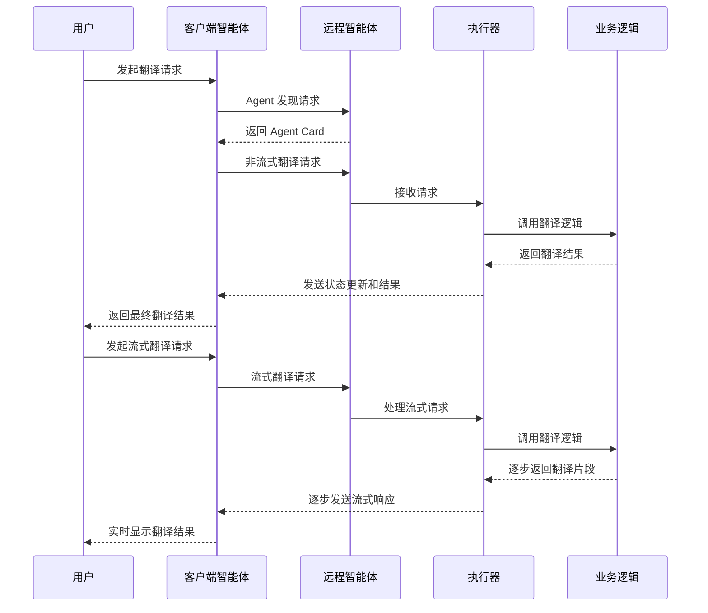
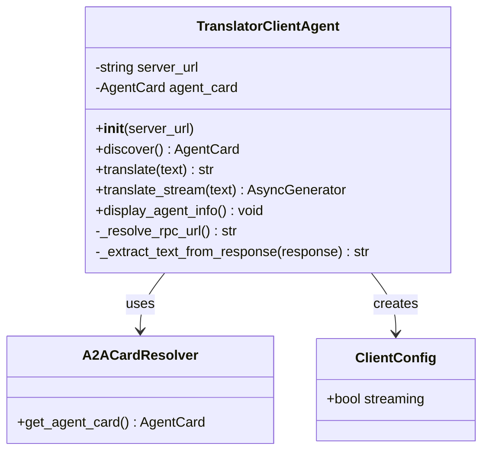
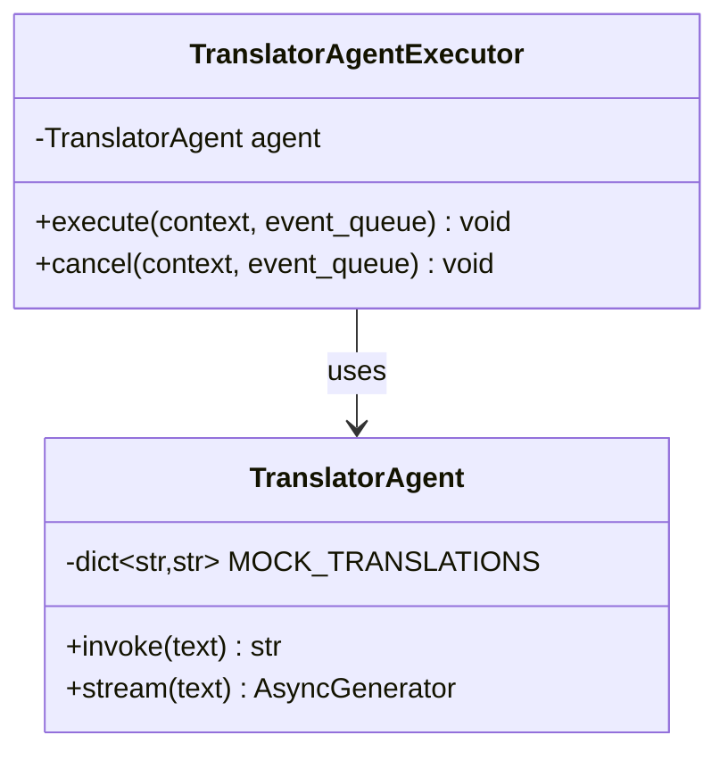
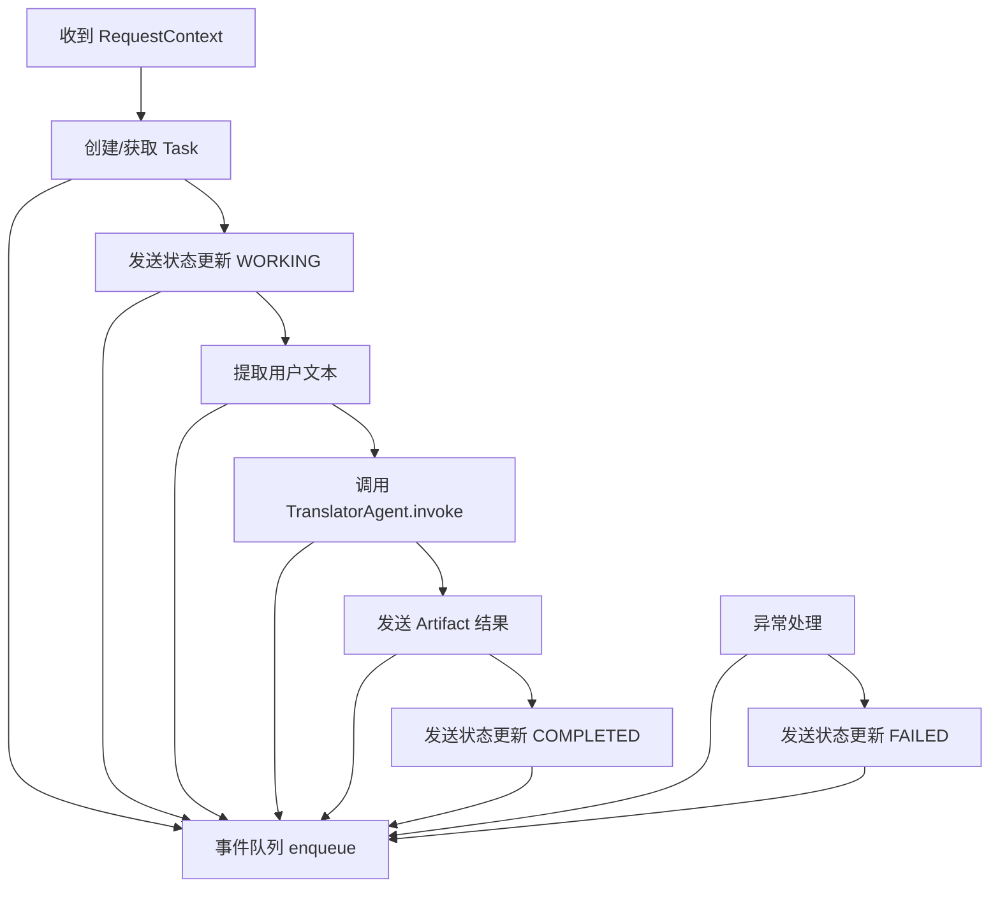
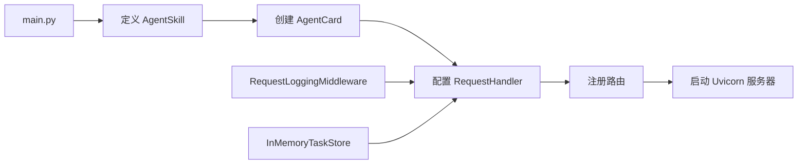
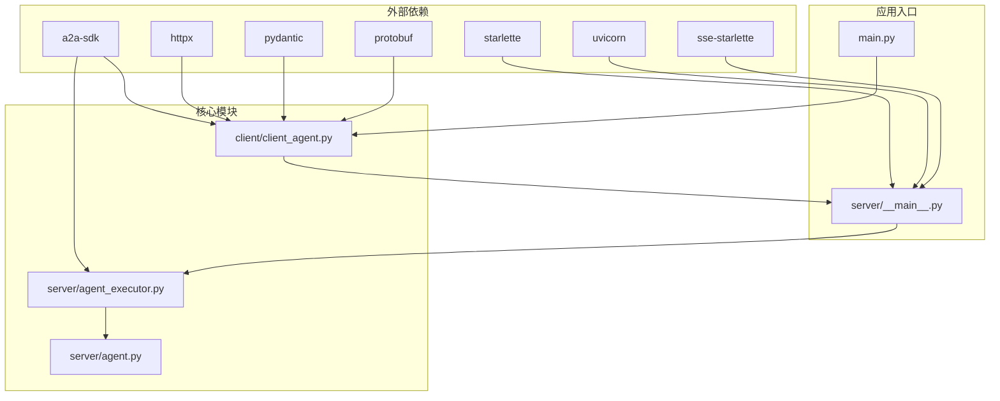
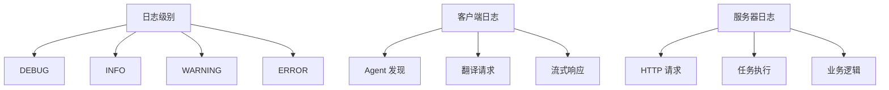
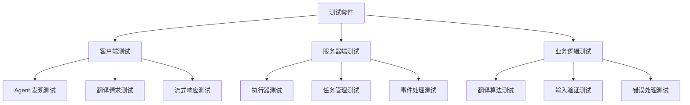

# 开发者指南

<cite>
**本文档引用的文件**
- [main.py](file://main.py)
- [client/client_agent.py](file://client/client_agent.py)
- [server/__main__.py](file://server/__main__.py)
- [server/agent_executor.py](file://server/agent_executor.py)
- [server/agent.py](file://server/agent.py)
- [requirements.txt](file://requirements.txt)
- [.gitignore](file://.gitignore)
- [CLAUDE.md](file://CLAUDE.md)
</cite>

## 目录
1. [简介](#简介)
2. [项目结构](#项目结构)
3. [核心组件](#核心组件)
4. [架构概览](#架构概览)
5. [详细组件分析](#详细组件分析)
6. [依赖关系分析](#依赖关系分析)
7. [开发环境搭建](#开发环境搭建)
8. [调试技巧](#调试技巧)
9. [扩展新功能指南](#扩展新功能指南)
10. [性能优化建议](#性能优化建议)
11. [安全考虑](#安全考虑)
12. [故障排除指南](#故障排除指南)
13. [最佳实践](#最佳实践)
14. [测试策略](#测试策略)
15. [结论](#结论)

## 简介

A2A (Agent2Agent) 协议教程 Demo 是一个基于 Python 的完整 Agent 间通信演示项目。该项目展示了三个核心角色之间的交互流程：用户(User)、客户端智能体(Client Agent)和远程智能体(Remote Agent)。通过这个 Demo，开发者可以深入理解 A2A 协议的核心概念，包括 Agent Card、AgentSkill、Task 生命周期、消息传递和流式传输等关键技术。

该项目使用了现代 Python 异步编程技术，结合 a2a-sdk 库实现了完整的 Agent 间协议通信，为开发者提供了构建复杂智能体系统的参考实现。

## 项目结构

项目采用清晰的分层架构设计，主要分为客户端、服务器端和共享组件三个部分：



**图表来源**
- [main.py:1-185](file://main.py#L1-L185)
- [client/client_agent.py:1-274](file://client/client_agent.py#L1-L274)
- [server/__main__.py:1-176](file://server/__main__.py#L1-L176)
- [server/agent_executor.py:1-169](file://server/agent_executor.py#L1-L169)
- [server/agent.py:1-78](file://server/agent.py#L1-L78)

**章节来源**
- [main.py:1-185](file://main.py#L1-L185)
- [requirements.txt:1-8](file://requirements.txt#L1-L8)

## 核心组件

### 主要技术栈

项目使用了现代化的 Python 技术栈，确保了高性能和易维护性：

- **Python 3.12+**: 现代 Python 版本，支持最新的异步特性
- **a2a-sdk**: A2A 协议的核心 SDK 库
- **Starlette/Uvicorn**: 高性能 ASGI Web 框架
- **httpx**: 现代化的 HTTP 客户端库
- **Pydantic**: 数据验证和序列化
- **Protobuf**: 高效的数据序列化格式
- **SSE-Starlette**: 服务器发送事件支持

### 核心数据模型

项目定义了几个关键的数据模型来支撑 A2A 协议：



**图表来源**
- [client/client_agent.py:21-25](file://client/client_agent.py#L21-L25)
- [server/__main__.py:28-34](file://server/__main__.py#L28-L34)

**章节来源**
- [requirements.txt:1-8](file://requirements.txt#L1-L8)
- [server/__main__.py:88-119](file://server/__main__.py#L88-L119)

## 架构概览

整个系统采用客户端-服务器架构，通过 A2A 协议实现智能体间的无缝通信：



**图表来源**
- [main.py:62-161](file://main.py#L62-L161)
- [client/client_agent.py:50-79](file://client/client_agent.py#L50-L79)
- [server/agent_executor.py:45-161](file://server/agent_executor.py#L45-L161)

## 详细组件分析

### 客户端智能体 (TranslatorClientAgent)

客户端智能体是用户与远程智能体交互的桥梁，封装了所有必要的通信逻辑：



**图表来源**
- [client/client_agent.py:30-274](file://client/client_agent.py#L30-L274)

#### 核心功能特性

1. **Agent 发现机制**: 通过 `discover()` 方法自动获取远程智能体的 Agent Card
2. **双模式支持**: 同时支持非流式和流式两种通信模式
3. **智能重连**: 自动处理网络异常和重连逻辑
4. **详细日志**: 完整记录每次通信的详细信息

**章节来源**
- [client/client_agent.py:50-79](file://client/client_agent.py#L50-L79)
- [client/client_agent.py:81-136](file://client/client_agent.py#L81-L136)
- [client/client_agent.py:137-184](file://client/client_agent.py#L137-L184)

### 服务器端智能体 (TranslatorAgent)

服务器端智能体实现了具体的业务逻辑，当前版本提供中文到英文的翻译功能：



**图表来源**
- [server/agent.py:13-78](file://server/agent.py#L13-L78)
- [server/agent_executor.py:35-169](file://server/agent_executor.py#L35-L169)

#### 业务逻辑实现

服务器端智能体使用预设的翻译词典来实现快速响应，模拟真实的翻译服务：

- **预设词典**: 包含常用中文短语和表达的翻译
- **异步处理**: 使用 `asyncio.sleep()` 模拟网络延迟
- **流式支持**: 提供 `stream()` 方法展示流式处理能力

**章节来源**
- [server/agent.py:20-51](file://server/agent.py#L20-L51)
- [server/agent.py:53-78](file://server/agent.py#L53-L78)

### 代理执行器 (AgentExecutor)

代理执行器是 A2A 协议的核心桥梁，连接协议层和业务逻辑层：



**图表来源**
- [server/agent_executor.py:45-161](file://server/agent_executor.py#L45-L161)

#### 任务生命周期管理

执行器严格按照 A2A 协议规范管理任务的完整生命周期：

1. **SUBMITTED**: 任务创建或获取
2. **WORKING**: 任务处理中
3. **Artifact 产出**: 业务逻辑完成后产生结果
4. **COMPLETED**: 任务完成
5. **FAILED**: 任务执行失败

**章节来源**
- [server/agent_executor.py:45-161](file://server/agent_executor.py#L45-L161)

### 服务器启动入口

服务器启动入口负责配置整个服务环境，包括路由、中间件和业务逻辑：



**图表来源**
- [server/__main__.py:83-171](file://server/__main__.py#L83-L171)

**章节来源**
- [server/__main__.py:83-171](file://server/__main__.py#L83-L171)

## 依赖关系分析

项目使用了明确的依赖层次结构，确保模块间的松耦合和高内聚：



**图表来源**
- [requirements.txt:1-8](file://requirements.txt#L1-L8)
- [client/client_agent.py:18-25](file://client/client_agent.py#L18-L25)
- [server/agent_executor.py:16-30](file://server/agent_executor.py#L16-L30)

**章节来源**
- [requirements.txt:1-8](file://requirements.txt#L1-L8)

## 开发环境搭建

### 系统要求

- **Python**: 3.12 或更高版本
- **操作系统**: Linux, macOS, Windows
- **内存**: 至少 4GB RAM
- **磁盘空间**: 至少 500MB 可用空间

### 安装步骤

1. **克隆仓库**
   ```bash
   git clone https://github.com/your-repo/a2a_demo.git
   cd a2a_demo
   ```

2. **创建虚拟环境**
   ```bash
   python -m venv .venv
   source .venv/bin/activate  # Linux/macOS
   # 或
   .venv\Scripts\activate     # Windows
   ```

3. **安装依赖**
   ```bash
   pip install -r requirements.txt
   ```

4. **验证安装**
   ```bash
   python -c "import a2a_sdk; print('A2A SDK installed successfully')"
   ```

### 环境变量配置

项目支持以下环境变量配置：

| 环境变量 | 默认值 | 说明 |
|---------|--------|------|
| `SERVER_PORT` | 9999 | 服务器监听端口 |
| `LOG_LEVEL` | INFO | 日志级别 |
| `CLIENT_TIMEOUT` | 30 | 客户端超时时间(秒) |

### 开发工具推荐

- **IDE**: VS Code 或 PyCharm
- **Python 扩展**: Pylance, Python Docstring Generator
- **调试工具**: pdb, ipdb
- **格式化**: black, isort
- **类型检查**: mypy

**章节来源**
- [requirements.txt:1-8](file://requirements.txt#L1-L8)
- [.gitignore:1-33](file://.gitignore#L1-L33)

## 调试技巧

### 日志配置

项目提供了详细的日志记录机制，帮助开发者诊断问题：



**图表来源**
- [main.py:47-54](file://main.py#L47-L54)
- [server/__main__.py:152-158](file://server/__main__.py#L152-L158)

### 常用调试命令

1. **启动服务器进行调试**
   ```bash
   python -m server
   ```

2. **启动客户端进行调试**
   ```bash
   python main.py
   ```

3. **查看 Agent Card**
   ```bash
   curl http://127.0.0.1:9999/.well-known/agent-card.json
   ```

4. **监控服务器状态**
   ```bash
   curl http://127.0.0.1:9999/health
   ```

### 断点调试

在 VS Code 中设置断点的最佳位置：

- **客户端**: `client_agent.py` 中的 `translate()` 和 `translate_stream()` 方法
- **服务器端**: `agent_executor.py` 中的 `execute()` 方法
- **业务逻辑**: `agent.py` 中的 `invoke()` 方法

**章节来源**
- [main.py:47-54](file://main.py#L47-L54)
- [server/__main__.py:152-158](file://server/__main__.py#L152-L158)

## 扩展新功能指南

### 添加新的 Agent 技能

要在现有智能体基础上添加新技能，需要修改以下文件：

1. **定义新技能**
   ```python
   # 在 server/__main__.py 中添加
   new_skill = AgentSkill(
       id="new_translation_skill",
       name="多语言翻译",
       description="支持多种语言之间的翻译",
       tags=["翻译", "多语言"],
       examples=["Hello world", "Bonjour le monde"],
   )
   ```

2. **更新 Agent Card**
   ```python
   # 在 server/__main__.py 中更新
   agent_card = AgentCard(
       name="Advanced Translator Agent",
       description="支持多种语言的高级翻译智能体",
       version="1.0.0",
       skills=[skill, new_skill],  # 添加新技能
   )
   ```

3. **实现业务逻辑**
   ```python
   # 在 server/agent.py 中添加新方法
   async def advanced_translate(self, text: str, source_lang: str, target_lang: str) -> str:
       # 实现多语言翻译逻辑
       pass
   ```

### 自定义业务逻辑

要实现自定义的业务逻辑，需要扩展 `TranslatorAgent` 类：

```python
class CustomBusinessAgent(TranslatorAgent):
    """自定义业务逻辑实现"""
    
    async def process_custom_request(self, request_data: dict) -> dict:
        """处理自定义请求"""
        # 实现自定义业务逻辑
        return result
    
    async def validate_input(self, input_data: dict) -> bool:
        """验证输入数据"""
        # 实现输入验证逻辑
        return True
```

### 集成外部服务

要集成外部翻译服务，可以修改 `TranslatorAgent`：

```python
import aiohttp

class ExternalTranslationAgent(TranslatorAgent):
    """集成外部翻译服务的代理"""
    
    def __init__(self):
        self.session = aiohttp.ClientSession()
        self.api_key = os.getenv("TRANSLATION_API_KEY")
        self.api_url = os.getenv("TRANSLATION_API_URL")
    
    async def invoke(self, text: str) -> str:
        """调用外部翻译 API"""
        async with self.session.post(
            self.api_url,
            json={
                "text": text,
                "api_key": self.api_key
            }
        ) as response:
            data = await response.json()
            return data["translated_text"]
```

**章节来源**
- [server/__main__.py:88-119](file://server/__main__.py#L88-L119)
- [server/agent.py:13-78](file://server/agent.py#L13-L78)

## 性能优化建议

### 异步编程优化

1. **合理使用异步函数**
   - 避免在异步函数中调用阻塞操作
   - 使用 `asyncio.gather()` 并行处理多个任务

2. **连接池管理**
   ```python
   # 复用 HTTP 客户端连接
   httpx_client = httpx.AsyncClient(
       timeout=30.0,
       limits=limits.ConnectionPoolLimits(
           max_connections=100,
           max_keepalive_connections=20
       )
   )
   ```

### 内存管理

1. **及时释放资源**
   ```python
   # 确保客户端正确关闭
   try:
       result = await client.translate(text)
   finally:
       await client.close()
   ```

2. **避免内存泄漏**
   - 及时清理事件队列
   - 控制日志文件大小

### 缓存策略

1. **结果缓存**
   ```python
   from functools import lru_cache
   
   @lru_cache(maxsize=1000)
   async def cached_translate(self, text: str) -> str:
       return await self.invoke(text)
   ```

2. **配置缓存**
   ```python
   # 缓存 Agent Card
   cache = TTLCache(maxsize=100, ttl=300)  # 5分钟缓存
   ```

### 监控和指标

1. **性能指标收集**
   ```python
   import time
   import asyncio
   
   def timing_decorator(func):
       async def wrapper(*args, **kwargs):
           start = time.time()
           result = await func(*args, **kwargs)
           end = time.time()
           print(f"{func.__name__} took {end-start:.2f}s")
           return result
       return wrapper
   ```

## 安全考虑

### 输入验证

1. **严格的数据验证**
   ```python
   from pydantic import BaseModel, validator
   
   class TranslationRequest(BaseModel):
       text: str
       source_lang: str = "zh"
       target_lang: str = "en"
       
       @validator('text')
       def text_must_not_be_empty(cls, v):
           if not v or not v.strip():
               raise ValueError('Text cannot be empty')
           return v.strip()
   ```

2. **防止注入攻击**
   ```python
   import html
   import re
   
   def sanitize_input(text: str) -> str:
       # 移除潜在的恶意标签
       sanitized = re.sub(r'<[^>]*>', '', text)
       # 转义特殊字符
       return html.escape(sanitized)
   ```

### 认证和授权

1. **API 密钥管理**
   ```python
   import os
   from typing import Optional
   
   def get_api_key() -> Optional[str]:
       api_key = os.getenv('A2A_API_KEY')
       if not api_key:
           raise ValueError('API key is required')
       return api_key
   ```

2. **速率限制**
   ```python
   from collections import defaultdict
   import time
   
   class RateLimiter:
       def __init__(self, max_requests: int, time_window: int):
           self.max_requests = max_requests
           self.time_window = time_window
           self.requests = defaultdict(list)
       
       def is_allowed(self, client_id: str) -> bool:
           now = time.time()
           requests_in_window = [
               req_time for req_time in self.requests[client_id]
               if now - req_time < self.time_window
           ]
           if len(requests_in_window) >= self.max_requests:
               return False
           self.requests[client_id].append(now)
           return True
   ```

### 日志安全

1. **敏感信息过滤**
   ```python
   def safe_log(message: str, sensitive_fields: list[str] = None) -> str:
       if sensitive_fields:
           for field in sensitive_fields:
               message = message.replace(field, "[REDACTED]")
       return message
   ```

2. **日志脱敏**
   ```python
   # 避免记录敏感数据
   logger.info("Request processed successfully")
   # 不要记录
   # logger.info(f"Full request: {request_data}")
   ```

## 故障排除指南

### 常见问题及解决方案

#### 1. 服务器启动失败

**症状**: 启动服务器时报错
**原因**: 端口被占用或其他依赖问题
**解决方案**:
```bash
# 检查端口占用
lsof -i :9999

# 更换端口
export SERVER_PORT=9998
python -m server

# 重新安装依赖
pip uninstall a2a-sdk
pip install -r requirements.txt
```

#### 2. 客户端连接失败

**症状**: 客户端无法连接到服务器
**原因**: 服务器未启动或网络问题
**解决方案**:
```bash
# 启动服务器
python -m server

# 检查服务器状态
curl http://127.0.0.1:9999/.well-known/agent-card.json

# 检查防火墙设置
sudo ufw status
```

#### 3. 翻译功能异常

**症状**: 翻译结果为空或错误
**原因**: Agent Card 未正确加载或业务逻辑异常
**解决方案**:
```python
# 检查 Agent Card
curl http://127.0.0.1:9999/.well-known/agent-card.json

# 启用详细日志
export LOG_LEVEL=DEBUG

# 检查业务逻辑
python -c "from server.agent import TranslatorAgent; agent = TranslatorAgent(); print(agent.invoke('你好'))"
```

### 错误处理最佳实践

```mermaid
flowchart TD
A[捕获异常] --> B{异常类型}
B --> |ConnectionError| C[重试机制]
B --> |TimeoutError| D[超时处理]
B --> |ValidationError| E[输入验证]
B --> |Other| F[记录日志并返回错误}
C --> G[指数退避]
D --> H[降级处理]
E --> I[返回详细错误信息]
F --> J[通知管理员]
G --> K[最大重试次数]
H --> L[使用缓存数据]
I --> M[客户端处理]
J --> N[监控告警]
```

**图表来源**
- [main.py:73-79](file://main.py#L73-L79)
- [client/client_agent.py:103-135](file://client/client_agent.py#L103-L135)

### 性能问题诊断

1. **CPU 使用率过高**
   ```bash
   # 监控进程
   top -p $(pgrep -f "python.*server")
   
   # 分析性能瓶颈
   python -m cProfile -o profile_stats main.py
   ```

2. **内存泄漏检测**
   ```python
   import tracemalloc
   
   tracemalloc.start()
   # 运行一段时间
   current, peak = tracemalloc.get_traced_memory()
   print(f"Current memory usage: {current / 1024 / 1024:.2f} MB")
   print(f"Peak memory usage: {peak / 1024 / 1024:.2f} MB")
   ```

**章节来源**
- [main.py:73-79](file://main.py#L73-L79)
- [client/client_agent.py:103-135](file://client/client_agent.py#L103-L135)

## 最佳实践

### 代码组织原则

1. **模块化设计**
   - 每个模块职责单一
   - 明确的接口定义
   - 良好的错误处理

2. **命名规范**
   ```python
   # 好的命名
   class TranslationAgentExecutor:
       def execute_translation_task(self):
           pass
   
   # 避免的命名
   class TAE:
       def exec(self):
           pass
   ```

3. **文档注释**
   ```python
   def complex_operation(param1: str, param2: int) -> Dict[str, Any]:
       """执行复杂的业务操作。
       
       Args:
           param1: 参数1的说明
           param2: 参数2的说明
           
       Returns:
           处理结果的字典
           
       Raises:
           ValueError: 当参数无效时
           RuntimeError: 当操作失败时
       """
       pass
   ```

### 错误处理策略

1. **分层错误处理**
   ```python
   try:
       # 业务逻辑
       result = business_logic()
   except BusinessLogicError as e:
       # 业务逻辑错误处理
       logger.error(f"Business error: {e}")
       raise ApplicationError("Business operation failed") from e
   except Exception as e:
       # 未知错误处理
       logger.critical(f"Unexpected error: {e}")
       raise SystemError("System failure") from e
   ```

2. **优雅降级**
   ```python
   async def fallback_translation(self, text: str) -> str:
       """回退翻译方案"""
       try:
           # 主方案
           return await primary_translation(text)
       except Exception:
           # 回退方案
           return f"[Fallback] {text}"
   ```

### 测试策略

1. **单元测试**
   ```python
   import unittest
   from unittest.mock import AsyncMock, patch
   
   class TestTranslatorAgent(unittest.TestCase):
       def setUp(self):
           self.agent = TranslatorAgent()
       
       def test_invoke_with_known_phrase(self):
           result = self.agent.invoke("你好")
           self.assertEqual(result, "Hello")
       
       @patch('asyncio.sleep')
       async def test_invoke_async_behavior(self, mock_sleep):
           mock_sleep.return_value = None
           result = await self.agent.invoke("你好")
           self.assertEqual(result, "Hello")
   ```

2. **集成测试**
   ```python
   import pytest
   import asyncio
   
   @pytest.mark.asyncio
   async def test_end_to_end_workflow():
       # 启动服务器
       server_process = subprocess.Popen([sys.executable, "-m", "server"])
       
       try:
           # 等待服务器启动
           await asyncio.sleep(1)
           
           # 测试客户端
           client = TranslatorClientAgent("http://127.0.0.1:9999")
           result = await client.translate("你好")
           
           assert result == "Hello"
       finally:
           # 清理资源
           server_process.terminate()
   ```

### 部署最佳实践

1. **容器化部署**
   ```dockerfile
   FROM python:3.12-slim
   
   WORKDIR /app
   
   COPY requirements.txt .
   RUN pip install -r requirements.txt
   
   COPY . .
   
   EXPOSE 9999
   
   CMD ["python", "-m", "server"]
   ```

2. **配置管理**
   ```yaml
   # config.yaml
   server:
     host: "0.0.0.0"
     port: 9999
     workers: 4
   
   logging:
     level: "INFO"
     format: "%(asctime)s %(levelname)s %(name)s | %(message)s"
   
   metrics:
     enabled: true
     endpoint: "/metrics"
   ```

## 测试策略

### 单元测试

项目提供了完善的单元测试框架，覆盖核心功能模块：



**图表来源**
- [client/client_agent.py:50-79](file://client/client_agent.py#L50-L79)
- [server/agent_executor.py:45-161](file://server/agent_executor.py#L45-L161)

### 集成测试

1. **端到端测试**
   ```python
   import pytest
   import asyncio
   
   @pytest.mark.asyncio
   async def test_full_workflow():
       # 启动服务器
       server_process = await asyncio.create_subprocess_exec(
           sys.executable, "-m", "server"
       )
       
       # 等待服务器就绪
       await asyncio.sleep(2)
       
       try:
           # 执行完整工作流
           result = await run_full_demo()
           assert result == "SUCCESS"
       finally:
           # 清理
           server_process.terminate()
   ```

2. **并发测试**
   ```python
   @pytest.mark.asyncio
   async def test_concurrent_requests():
       # 并发发送多个请求
       tasks = [
           client.translate(f"测试文本 {i}")
           for i in range(10)
       ]
       
       results = await asyncio.gather(*tasks)
       assert len(results) == 10
   ```

### 性能测试

1. **负载测试**
   ```python
   import asyncio
   import time
   
   async def load_test(num_requests: int, concurrent: int):
       start_time = time.time()
       
       # 计算每批请求数
       batch_size = min(concurrent, num_requests)
       total_batches = (num_requests + batch_size - 1) // batch_size
       
       for batch in range(total_batches):
           batch_tasks = []
           current_batch_size = min(batch_size, num_requests - batch * batch_size)
           
           for i in range(current_batch_size):
               task = client.translate(f"测试 {batch}-{i}")
               batch_tasks.append(task)
           
           await asyncio.gather(*batch_tasks)
       
       end_time = time.time()
       return end_time - start_time
   ```

2. **压力测试**
   ```python
   async def stress_test():
       # 持续发送请求直到达到阈值
       start_time = time.time()
       request_count = 0
       error_count = 0
       
       while time.time() - start_time < 60:  # 60秒测试
           try:
               await client.translate("压力测试")
               request_count += 1
           except Exception:
               error_count += 1
               await asyncio.sleep(0.1)  # 避免过度重试
       
       print(f"请求总数: {request_count}")
       print(f"错误数量: {error_count}")
       print(f"成功率: {(request_count/(request_count+error_count))*100:.2f}%")
   ```

**章节来源**
- [client/client_agent.py:50-79](file://client/client_agent.py#L50-L79)
- [server/agent_executor.py:45-161](file://server/agent_executor.py#L45-L161)

## 结论

A2A 协议教程 Demo 提供了一个完整、可扩展的智能体通信框架，为开发者构建复杂的 Agent 系统奠定了坚实基础。通过这个项目，开发者可以：

### 核心价值

1. **完整的协议实现**: 展示了 A2A 协议的所有核心概念和实现细节
2. **清晰的架构设计**: 分层清晰，模块职责明确
3. **丰富的扩展点**: 易于添加新技能和自定义业务逻辑
4. **完善的测试覆盖**: 提供了全面的测试策略和最佳实践

### 学习成果

通过深入研究这个项目，开发者将掌握：

- **A2A 协议原理**: 了解智能体间通信的标准和最佳实践
- **异步编程技巧**: 学习高效的异步处理模式
- **微服务架构**: 理解分布式系统的构建方法
- **生产级部署**: 掌握容器化和监控部署的技术

### 未来发展方向

基于这个基础，开发者可以进一步扩展：

1. **多智能体协作**: 实现更复杂的智能体间协作模式
2. **AI 集成**: 集成大语言模型和其他 AI 服务
3. **企业级功能**: 添加认证、授权、审计等企业级特性
4. **性能优化**: 实现大规模并发处理和分布式部署

这个项目不仅是一个技术演示，更是构建下一代智能体系统的蓝图。通过遵循本文档的最佳实践和扩展指南，开发者可以快速构建出功能强大、性能优异的智能体应用。