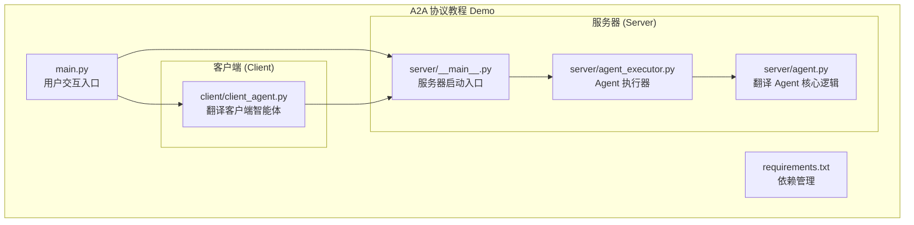

# 快速开始

<cite>
**本文档引用的文件**
- [README.md](file://README.md)
- [main.py](file://main.py)
- [requirements.txt](file://requirements.txt)
- [client/client_agent.py](file://client/client_agent.py)
- [server/__main__.py](file://server/__main__.py)
- [server/agent_executor.py](file://server/agent_executor.py)
- [server/agent.py](file://server/agent.py)
</cite>

## 目录
1. [简介](#简介)
2. [项目结构](#项目结构)
3. [环境准备](#环境准备)
4. [依赖安装](#依赖安装)
5. [服务器启动](#服务器启动)
6. [客户端运行](#客户端运行)
7. [预期输出示例](#预期输出示例)
8. [常见问题排查](#常见问题排查)
9. [总结](#总结)

## 简介

A2A (Agent2Agent) 协议教程 Demo 是一个基于 A2A 官方 SDK 的完整教程案例，演示了三个核心角色之间的闭环交互流程：用户 → 客户端智能体 → 远程智能体 → 客户端智能体 → 用户。

本项目特别适合新手开发者快速了解和体验 A2A 协议的核心概念，包括 Agent Card、AgentSkill、Task 生命周期、Message/Part 通信格式、Artifact 产出物以及 Streaming 流式传输等功能。

## 项目结构



**图表来源**
- [main.py:1-185](file://main.py#L1-L185)
- [client/client_agent.py:1-274](file://client/client_agent.py#L1-L274)
- [server/__main__.py:1-176](file://server/__main__.py#L1-L176)
- [server/agent_executor.py:1-169](file://server/agent_executor.py#L1-L169)
- [server/agent.py:1-78](file://server/agent.py#L1-L78)

**章节来源**
- [README.md:28-43](file://README.md#L28-L43)

## 环境准备

### 系统要求
- Python 3.8 或更高版本
- pip 包管理器
- 基本的命令行操作能力

### 开发环境设置步骤

1. **创建虚拟环境**
   ```bash
   python -m venv .venv
   ```

2. **激活虚拟环境**
   - macOS/Linux:
     ```bash
     source .venv/bin/activate
     ```
   - Windows:
     ```cmd
     .venv\Scripts\activate
     ```

3. **验证 Python 版本**
   ```bash
   python --version
   ```

**注意事项：**
- 确保使用独立的虚拟环境，避免污染系统 Python 环境
- 如果系统有多个 Python 版本，建议明确指定使用 Python 3.8+
- 虚拟环境路径为 `.venv`，可根据需要修改

## 依赖安装

### 安装步骤

1. **激活虚拟环境**
   ```bash
   source .venv/bin/activate
   ```

2. **安装项目依赖**
   ```bash
   pip install -r requirements.txt
   ```

### 依赖说明

项目使用以下核心依赖：

| 依赖包 | 版本要求 | 用途 |
|--------|----------|------|
| a2a-sdk | >=1.0.0 | A2A 协议核心 SDK |
| httpx | >=0.28.1 | 异步 HTTP 客户端 |
| pydantic | >=2.11.0 | 数据验证和序列化 |
| starlette | >=0.46.2 | ASGI Web 框架 |
| uvicorn | >=0.34.2 | ASGI 服务器 |
| sse-starlette | >=2.3.5 | 服务器推送事件 |
| protobuf | >=5.29,<7 | Protocol Buffers 支持 |

### 验证安装

安装完成后，可以验证依赖是否正确安装：

```bash
pip list | grep -E "(a2a-sdk|httpx|pydantic|starlette|uvicorn|sse-starlette|protobuf)"
```

**章节来源**
- [requirements.txt:1-8](file://requirements.txt#L1-L8)
- [README.md:47-55](file://README.md#L47-L55)

## 服务器启动

### 启动步骤

1. **确保虚拟环境已激活**
   ```bash
   source .venv/bin/activate
   ```

2. **启动 A2A 服务器**
   ```bash
   python -m server
   ```

### 服务器配置详解

服务器启动后会进行以下初始化步骤：

1. **定义 Agent 技能**
   - 技能 ID: `translate_zh_to_en`
   - 技能名称: 中文翻译为英文
   - 技能描述: 将中文文本翻译为英文
   - 支持的标签: 翻译、中文、英文、translation
   - 示例输入: 你好、今天天气怎么样、人工智能

2. **创建 Agent 名片**
   - Agent 名称: `Translator Agent (翻译智能体)`
   - 版本: `1.0.0`
   - 支持的接口: JSONRPC，URL: `http://127.0.0.1:9999`
   - 默认输入输出模式: `text/plain`

3. **配置请求处理器**
   - 使用 `DefaultRequestHandler` 处理请求
   - 使用 `InMemoryTaskStore` 存储任务状态
   - 配置 `TranslatorAgentExecutor` 执行器

4. **启动 HTTP 服务器**
   - 主机: `127.0.0.1`
   - 端口: `9999`
   - 使用 `uvicorn` 作为 ASGI 服务器

### 服务器日志输出

启动后会显示详细的服务器信息：

```
============================================================
  A2A 翻译智能体服务器 (Remote Agent)
============================================================
  Agent 名称:  Translator Agent (翻译智能体)
  服务地址:    http://127.0.0.1:9999
  Agent Card:  http://127.0.0.1:9999/.well-known/agent-card.json
============================================================
```

**章节来源**
- [server/__main__.py:83-171](file://server/__main__.py#L83-L171)
- [README.md:57-72](file://README.md#L57-L72)

## 客户端运行

### 运行步骤

1. **确保虚拟环境已激活**
   ```bash
   source .venv/bin/activate
   ```

2. **在新终端中运行客户端**
   ```bash
   python main.py
   ```

### 客户端工作流程

客户端运行会自动执行以下三个阶段：

#### 阶段 1：Agent 发现 (Discovery)

1. **连接远程 Agent**
   - 请求地址: `http://127.0.0.1:9999/.well-known/agent-card.json`
   - 获取 Agent Card 信息

2. **显示 Agent 信息**
   - Agent 名称: `Translator Agent (翻译智能体)`
   - 技能列表: 中文翻译为英文
   - 支持的接口: JSONRPC

#### 阶段 2：非流式翻译请求

1. **发送翻译请求**
   - 测试文本: 你好、人工智能、今天天气怎么样
   - 请求方式: JSON-RPC (非流式)
   - 等待完整响应

2. **显示翻译结果**
   - 每个请求都会显示完整的翻译结果

#### 阶段 3：流式翻译请求

1. **发送流式翻译请求**
   - 文本: 我是一个AI助手
   - 请求方式: JSON-RPC (SSE 流式)

2. **实时显示翻译过程**
   - 显示 Task 生命周期状态变化
   - 实时展示翻译结果的逐步生成

### 客户端核心功能

客户端智能体 (`TranslatorClientAgent`) 提供以下主要功能：

1. **Agent 发现**: 通过 `discover()` 方法获取远程 Agent 的名片信息
2. **非流式翻译**: 通过 `translate()` 方法发送请求并等待完整结果
3. **流式翻译**: 通过 `translate_stream()` 方法接收实时流式响应
4. **信息展示**: 通过 `display_agent_info()` 方法展示 Agent 详细信息

**章节来源**
- [main.py:43-180](file://main.py#L43-L180)
- [client/client_agent.py:30-274](file://client/client_agent.py#L30-L274)

## 预期输出示例

### 服务器启动输出

```bash
============================================================
  A2A 翻译智能体服务器 (Remote Agent)
============================================================
  Agent 名称:  Translator Agent (翻译智能体)
  服务地址:    http://127.0.0.1:9999
  Agent Card:  http://127.0.0.1:9999/.well-known/agent-card.json
============================================================
```

### 客户端运行输出

#### 阶段 1：Agent 发现
```
============================================================
  阶段 1：Agent 发现 (Discovery)
============================================================
  👤 [用户] 本 Demo 演示 A2A 协议中三个核心角色的交互流程：
  👤 [用户] 用户 → 客户端智能体 → 远程智能体 → 客户端智能体 → 用户

  🤖 [客户端智能体] 正在连接远程 Agent，获取 Agent Card...
  🤖 [客户端智能体] 请求地址: http://127.0.0.1:9999/.well-known/agent-card.json

  🤖 [客户端智能体] 原始 agent_card 对象:
  🤖 [客户端智能体] 成功获取 Agent Card！远程 Agent 信息如下：
  --------------------------------------------------
  名称:    Translator Agent (翻译智能体)
  描述:    一个基于 A2A 协议的智能翻译 Agent，能够将中文翻译为英文。这是一个教学演示 Agent。
  版本:    1.0.0
  技能列表:
    - 中文翻译为英文: 将中文文本翻译为英文。支持常用短语和句子的翻译。
      示例输入: "你好", "今天天气怎么样", "人工智能"
  --------------------------------------------------
```

#### 阶段 2：非流式翻译
```
============================================================
  阶段 2：非流式翻译请求 (Non-Streaming)
============================================================
  👤 [用户] 请翻译: "你好"
  🤖 [客户端智能体] 正在将请求转发给远程 Agent...
  🌐 [远程智能体] 翻译结果: "Hello"

  👤 [用户] 请翻译: "人工智能"
  🤖 [客户端智能体] 正在将请求转发给远程 Agent...
  🌐 [远程智能体] 翻译结果: "Artificial Intelligence"

  👤 [用户] 请翻译: "今天天气怎么样"
  🤖 [客户端智能体] 正在将请求转发给远程 Agent...
  🌐 [远程智能体] 翻译结果: "How is the weather today"
```

#### 阶段 3：流式翻译
```
============================================================
  阶段 3：流式翻译请求 (Streaming)
============================================================
  👤 [用户] 请翻译（流式）: "我是一个AI助手"
  🤖 [客户端智能体] 正在以流式方式接收翻译结果...

  收到的流式响应 chunks:
    chunk #1 [Task 创建]     → 任务已提交 (SUBMITTED)
    chunk #2 [状态更新]     → 正在处理中 (WORKING)
    chunk #3 [产出物到达]   → 翻译结果: "I am an AI assistant"
    chunk #4 [状态更新]     → 任务完成 (COMPLETED): 翻译完成: 我是一个AI助手 → I am an AI assistant

  客户端智能体] 流式传输完成，共 4 个 chunk

  任务生命周期回顾:
    SUBMITTED → WORKING → Artifact 产出 → COMPLETED
```

**章节来源**
- [main.py:67-180](file://main.py#L67-L180)

## 常见问题排查

### 问题 1：端口被占用

**症状**:
```
OSError: [Errno 48] Address already in use
```

**解决方案**:
```bash
# 查找占用端口的进程
lsof -i :9999

# 终止占用进程
kill -9 <进程ID>

# 或者修改服务器端口
uvicorn.run(app, host="127.0.0.1", port=9998)
```

### 问题 2：虚拟环境未激活

**症状**:
```
ModuleNotFoundError: No module named 'a2a'
```

**解决方案**:
```bash
# 激活虚拟环境
source .venv/bin/activate

# 验证依赖安装
pip list | grep a2a-sdk
```

### 问题 3：服务器启动失败

**症状**:
```
ImportError: cannot import name 'AgentCard' from 'a2a.types'
```

**解决方案**:
```bash
# 重新安装依赖
pip uninstall a2a-sdk
pip install a2a-sdk[http-server]>=1.0.0

# 或者升级到最新版本
pip install --upgrade a2a-sdk
```

### 问题 4：网络连接超时

**症状**:
```
ConnectionError: HTTPConnectionPool(host='127.0.0.1', port=9999): Max retries exceeded
```

**解决方案**:
```bash
# 确认服务器已启动
ps aux | grep server

# 检查防火墙设置
sudo ufw status

# 重启服务器
python -m server
```

### 问题 5：Python 版本不兼容

**症状**:
```
SyntaxError: invalid syntax
```

**解决方案**:
```bash
# 检查 Python 版本
python --version

# 升级到 Python 3.8+
python3.8 -m venv .venv
```

### 问题 6：依赖版本冲突

**症状**:
```
ERROR: Cannot install requirements.txt
```

**解决方案**:
```bash
# 清理缓存
pip cache purge

# 升级 pip
pip install --upgrade pip

# 重新安装
pip install -r requirements.txt
```

## 总结

通过本快速开始指南，您已经完成了 A2A 协议教程 Demo 的完整部署和运行。整个过程包括：

1. **环境准备**: 创建并激活虚拟环境
2. **依赖安装**: 安装所有必要的 Python 包
3. **服务器启动**: 启动 A2A 远程智能体服务器
4. **客户端运行**: 执行完整的 A2A 协议交互流程

现在您应该能够看到三个核心角色之间的完整交互效果，包括 Agent 发现、非流式翻译和流式翻译功能。这些功能为您深入理解 A2A 协议的核心概念奠定了坚实基础。

**下一步建议**:
- 深入阅读 `README.md` 中的代码解读部分
- 修改 `server/agent.py` 中的翻译逻辑，集成真实的翻译 API
- 扩展客户端功能，添加更多类型的 Agent 技能
- 探索 A2A 协议的高级特性，如任务取消、错误处理等

祝您在 A2A 协议的学习和开发中取得成功！