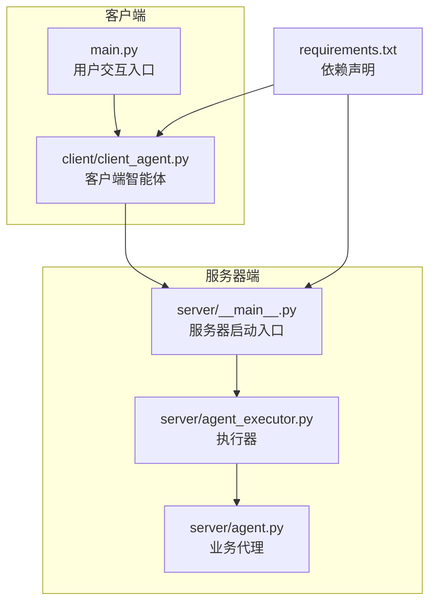
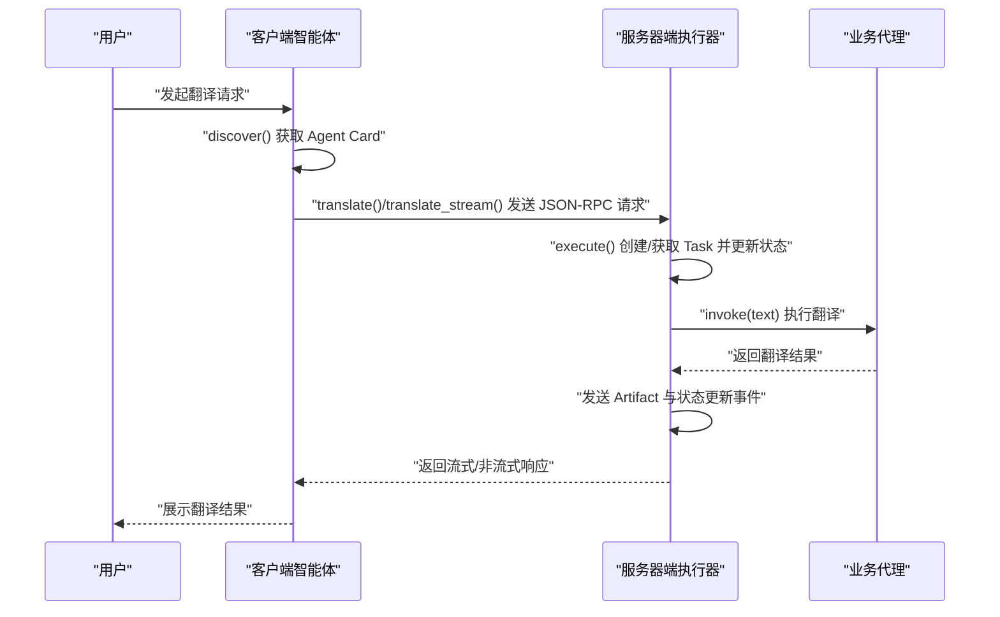
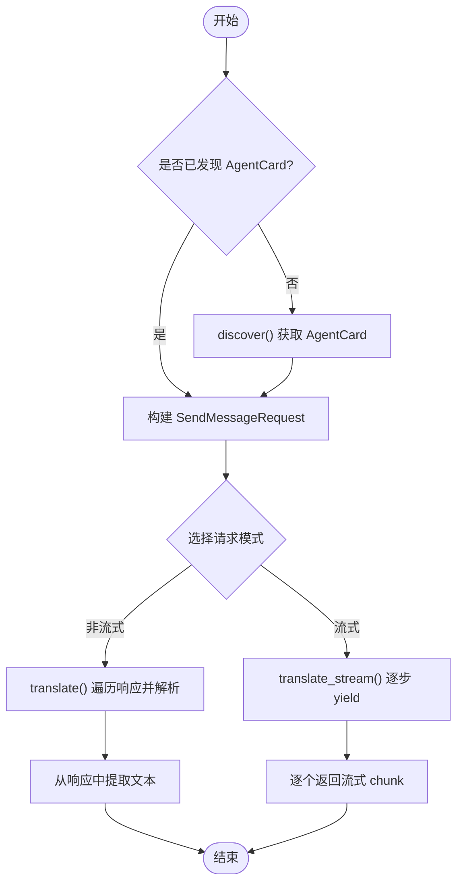
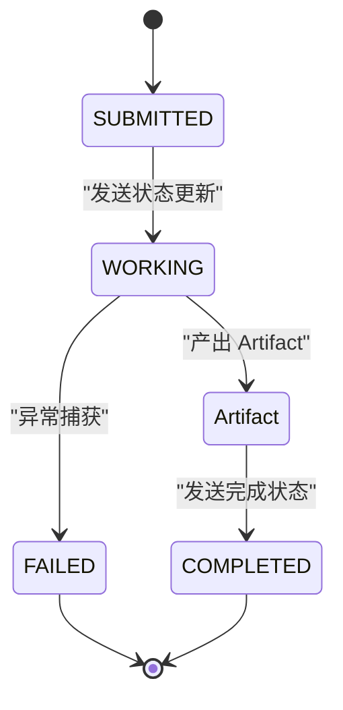
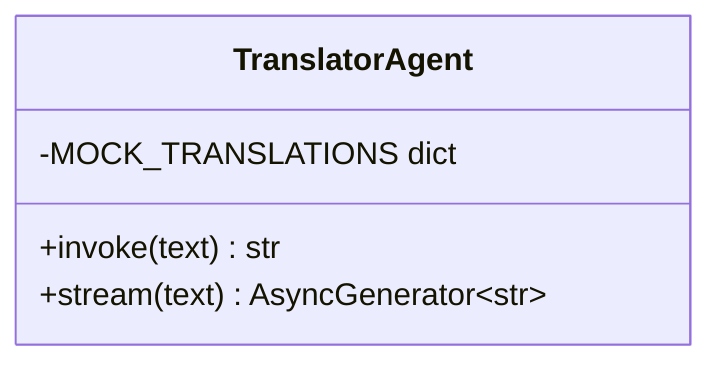
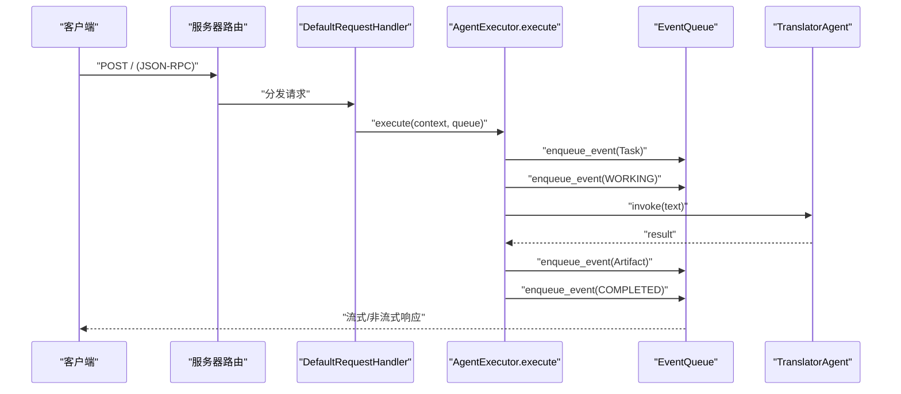
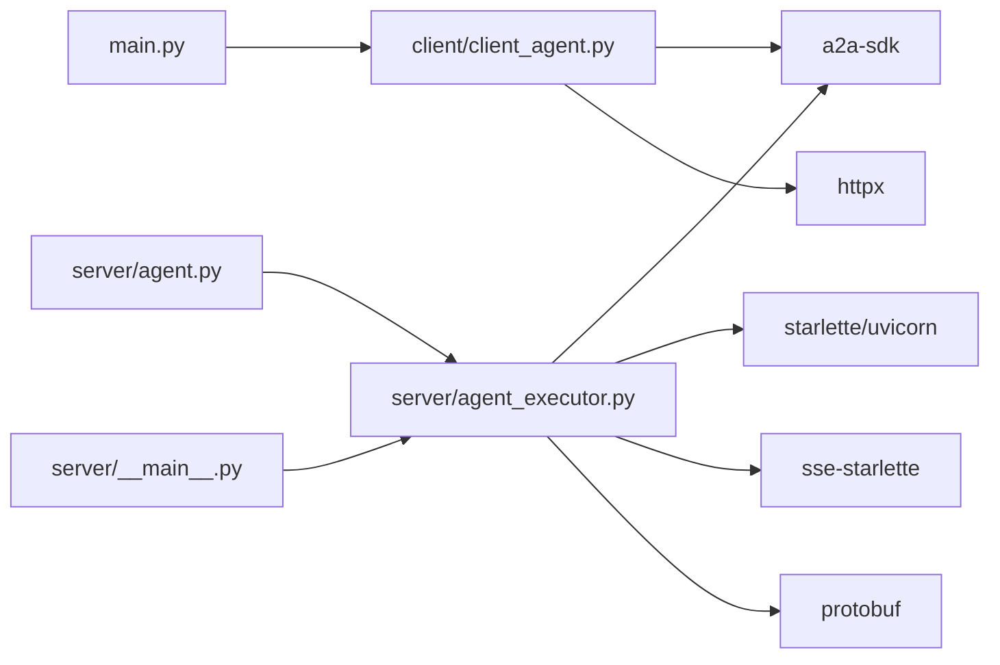

# 核心模块详解

<cite>
**本文档引用的文件**
- [client/client_agent.py](file://client/client_agent.py)
- [server/agent_executor.py](file://server/agent_executor.py)
- [server/agent.py](file://server/agent.py)
- [server/__main__.py](file://server/__main__.py)
- [main.py](file://main.py)
- [requirements.txt](file://requirements.txt)
</cite>

## 目录
1. [简介](#简介)
2. [项目结构](#项目结构)
3. [核心组件](#核心组件)
4. [架构总览](#架构总览)
5. [详细组件分析](#详细组件分析)
6. [依赖关系分析](#依赖关系分析)
7. [性能考虑](#性能考虑)
8. [故障排除指南](#故障排除指南)
9. [结论](#结论)

## 简介
本项目实现了 A2A（Agent-to-Agent）协议的端到端演示，重点覆盖以下核心能力：
- 客户端智能体模块：Agent 发现机制、翻译请求处理、响应解析与流式输出
- 服务器端执行器：任务生命周期管理、状态更新、Artifact 产出
- JSON-RPC 协议实现与消息格式
- 具体的使用模式与代码示例路径

该文档旨在帮助开发者快速理解模块职责、数据流与接口设计，并提供可操作的排障建议与优化方向。

## 项目结构
项目采用分层组织，按功能划分客户端与服务器端模块，配合入口脚本完成完整的交互闭环。

图表来源
- [client/client_agent.py:1-274](file://client/client_agent.py#L1-L274)
- [server/__main__.py:1-176](file://server/__main__.py#L1-L176)
- [server/agent_executor.py:1-169](file://server/agent_executor.py#L1-L169)
- [server/agent.py:1-78](file://server/agent.py#L1-L78)
- [main.py:1-185](file://main.py#L1-L185)
- [requirements.txt:1-8](file://requirements.txt#L1-L8)

章节来源
- [client/client_agent.py:1-274](file://client/client_agent.py#L1-L274)
- [server/__main__.py:1-176](file://server/__main__.py#L1-L176)
- [server/agent_executor.py:1-169](file://server/agent_executor.py#L1-L169)
- [server/agent.py:1-78](file://server/agent.py#L1-L78)
- [main.py:1-185](file://main.py#L1-L185)
- [requirements.txt:1-8](file://requirements.txt#L1-L8)

## 核心组件
- 客户端智能体（TranslatorClientAgent）
  - 负责 Agent 发现（获取 Agent Card）、发送非流式/流式翻译请求、解析响应并提取文本
  - 关键方法：discover、translate、translate_stream、display_agent_info、_extract_text_from_response
- 服务器端执行器（TranslatorAgentExecutor）
  - 实现 AgentExecutor 接口，处理 RequestContext，驱动 TranslatorAgent 执行翻译，维护任务生命周期与事件队列
  - 关键方法：execute、cancel
- 业务代理（TranslatorAgent）
  - 提供翻译能力，包含同步翻译与流式翻译的模拟实现
  - 关键方法：invoke、stream
- 服务器入口（server/__main__.py）
  - 定义 Agent 技能与名片，配置请求处理器与路由，启动 HTTP 服务器
- 用户交互入口（main.py）
  - 演示完整的 A2A 交互流程，包含发现、非流式与流式翻译

章节来源
- [client/client_agent.py:30-274](file://client/client_agent.py#L30-L274)
- [server/agent_executor.py:35-169](file://server/agent_executor.py#L35-L169)
- [server/agent.py:13-78](file://server/agent.py#L13-L78)
- [server/__main__.py:83-171](file://server/__main__.py#L83-L171)
- [main.py:43-180](file://main.py#L43-L180)

## 架构总览
下图展示了从用户发起请求到最终返回翻译结果的完整链路，涵盖客户端智能体、服务器端执行器与业务代理之间的交互。

图表来源
- [main.py:93-160](file://main.py#L93-L160)
- [client/client_agent.py:81-184](file://client/client_agent.py#L81-L184)
- [server/agent_executor.py:45-161](file://server/agent_executor.py#L45-L161)
- [server/agent.py:34-51](file://server/agent.py#L34-L51)

## 详细组件分析

### 客户端智能体模块（Agent 发现、请求处理、响应解析）
- Agent 发现机制
  - 通过 HTTP GET 访问 `/.well-known/agent-card.json` 获取 AgentCard，包含名称、版本、技能列表、支持的接口等元信息
  - 解析 AgentCard 的 supported_interfaces 中的 URL 作为后续 JSON-RPC 请求的目标端点
- 翻译请求处理
  - 非流式：设置 ClientConfig(streaming=False)，构造 SendMessageRequest，遍历 client.send_message() 的异步迭代器，解析响应并提取文本
  - 流式：设置 ClientConfig(streaming=True)，直接 yield 流式响应块，便于实时展示状态与中间结果
- 响应解析
  - 使用 protobuf 的 oneof 字段判断 payload 类型，分别处理 task、message、status_update、artifact_update 等
  - 优先从 artifacts.parts.text 提取翻译结果，其次回退到 status.message.parts.text
- 使用模式
  - discover() → translate()/translate_stream() → close()

图表来源
- [client/client_agent.py:50-184](file://client/client_agent.py#L50-L184)
- [client/client_agent.py:218-274](file://client/client_agent.py#L218-L274)

章节来源
- [client/client_agent.py:50-184](file://client/client_agent.py#L50-L184)
- [client/client_agent.py:218-274](file://client/client_agent.py#L218-L274)

### 服务器端执行器（任务生命周期、状态更新、Artifact 产出）
- 职责概述
  - 从 RequestContext 中提取用户消息，调用 TranslatorAgent 执行翻译
  - 通过 EventQueue 发送 Task 生命周期事件：创建 → WORKING → 产出 Artifact → COMPLETED
- 任务生命周期
  - Step 1：创建或获取 Task，并入队初始事件
  - Step 2：发送状态更新事件，状态置为 WORKING
  - Step 3：从消息中提取文本
  - Step 4：调用 TranslatorAgent.invoke 执行翻译
  - Step 5：发送 Artifact（名称 translation_result，文本为翻译结果）
  - Step 6：发送状态更新事件，状态置为 COMPLETED
- 错误处理
  - 捕获异常并发送 FAILED 状态事件，便于客户端感知错误

图表来源
- [server/agent_executor.py:45-161](file://server/agent_executor.py#L45-L161)

章节来源
- [server/agent_executor.py:35-169](file://server/agent_executor.py#L35-L169)

### 业务代理（TranslatorAgent）
- 能力说明
  - 提供同步翻译 invoke(text) 与流式翻译 stream(text) 两种能力
  - 使用预设词典进行模拟翻译，支持延时以模拟真实调用耗时
- 扩展建议
  - 可替换为外部翻译 API 或 LLM 调用
  - 若需要流式输出，可在执行器中切换为 stream() 并结合事件队列逐步推送

图表来源
- [server/agent.py:13-78](file://server/agent.py#L13-L78)

章节来源
- [server/agent.py:13-78](file://server/agent.py#L13-L78)

### JSON-RPC 协议实现与消息格式
- 协议绑定
  - 服务器端声明 JSONRPC 协议绑定，客户端通过 AgentCard 的 supported_interfaces.url 获取 RPC 端点
- 请求路由
  - 服务器注册两类路由：Agent Card 路由（GET /.well-known/agent-card.json）与 JSON-RPC 路由（POST /）
  - DefaultRequestHandler 将 JSON-RPC 请求路由到 AgentExecutor.execute
- 请求/响应日志
  - 服务器内置 HTTP 请求/响应日志中间件，记录 method、path、headers、body 与响应状态与耗时
- 消息格式要点
  - 客户端发送 SendMessageRequest（包含 message，其中 parts 为文本）
  - 服务器通过 EventQueue 发送 TaskStatusUpdateEvent、TaskArtifactUpdateEvent 等事件
  - 客户端解析 oneof payload（task、message、status_update、artifact_update）以还原任务状态与结果

图表来源
- [server/__main__.py:127-141](file://server/__main__.py#L127-L141)
- [server/agent_executor.py:45-161](file://server/agent_executor.py#L45-L161)
- [client/client_agent.py:98-135](file://client/client_agent.py#L98-L135)

章节来源
- [server/__main__.py:83-171](file://server/__main__.py#L83-L171)
- [client/client_agent.py:98-135](file://client/client_agent.py#L98-L135)

## 依赖关系分析
- 组件耦合
  - 客户端智能体依赖 A2A SDK 的 ClientConfig、create_client、A2ACardResolver、new_text_message 等工具
  - 服务器端执行器依赖 A2A SDK 的 AgentExecutor、RequestContext、EventQueue、Task* 类型与 helpers
  - 业务代理与执行器之间通过接口解耦，便于替换为真实翻译服务
- 外部依赖
  - httpx：异步 HTTP 客户端
  - starlette/uvicorn：HTTP 服务器框架
  - sse-starlette：SSE 流式支持
  - protobuf：消息序列化与 oneof 字段解析

图表来源
- [requirements.txt:1-8](file://requirements.txt#L1-L8)
- [client/client_agent.py:13-25](file://client/client_agent.py#L13-L25)
- [server/agent_executor.py:14-30](file://server/agent_executor.py#L14-L30)
- [server/__main__.py:20-40](file://server/__main__.py#L20-L40)

章节来源
- [requirements.txt:1-8](file://requirements.txt#L1-L8)
- [client/client_agent.py:13-25](file://client/client_agent.py#L13-L25)
- [server/agent_executor.py:14-30](file://server/agent_executor.py#L14-L30)
- [server/__main__.py:20-40](file://server/__main__.py#L20-L40)

## 性能考虑
- 异步 I/O
  - 客户端与服务器均采用异步编程模型，充分利用 I/O 密集场景的并发优势
- 流式传输
  - 流式翻译可显著改善用户体验，减少首字节延迟；在执行器中可根据需要启用
- 事件队列与任务存储
  - 使用内存任务存储（InMemoryTaskStore）适合演示场景；生产环境建议使用持久化存储与分布式队列
- 日志开销
  - 服务器端中间件会记录请求/响应详情，建议在高负载场景下调低日志级别

## 故障排除指南
- 无法连接到服务器
  - 确认服务器已启动且监听地址为 127.0.0.1:9999
  - 检查网络连通性与防火墙设置
- Agent 发现失败
  - 确认服务器已正确注册 Agent Card 路由
  - 检查客户端 server_url 与服务器地址一致
- 翻译请求无响应
  - 检查客户端是否正确解析 AgentCard 的 supported_interfaces.url
  - 确认服务器端 JSON-RPC 路由已注册并可访问
- 流式输出异常
  - 确认客户端以 streaming=True 方式创建客户端
  - 检查服务器端 SSE 支持与 EventQueue 配置
- 状态与 Artifact 未更新
  - 检查执行器是否正确发送 TaskStatusUpdateEvent 与 TaskArtifactUpdateEvent
  - 确认客户端解析 oneof payload 的分支逻辑

章节来源
- [main.py:73-79](file://main.py#L73-L79)
- [client/client_agent.py:59-78](file://client/client_agent.py#L59-L78)
- [server/__main__.py:136-141](file://server/__main__.py#L136-L141)
- [server/agent_executor.py:82-144](file://server/agent_executor.py#L82-L144)

## 结论
本项目完整演示了 A2A 协议在翻译场景下的应用，涵盖了客户端智能体的 Agent 发现、请求处理与响应解析，以及服务器端执行器的任务生命周期管理与 Artifact 产出。通过清晰的模块划分与丰富的日志输出，开发者可以快速理解各组件职责与交互流程，并在此基础上扩展为更复杂的业务场景。