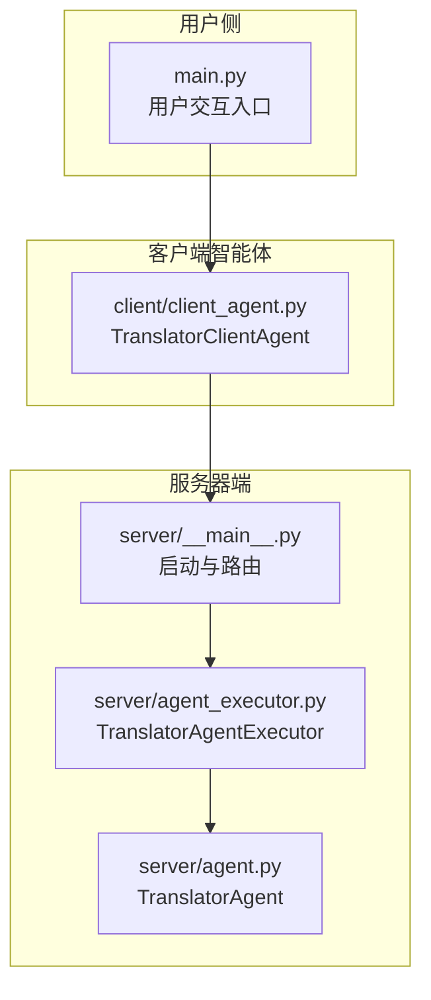
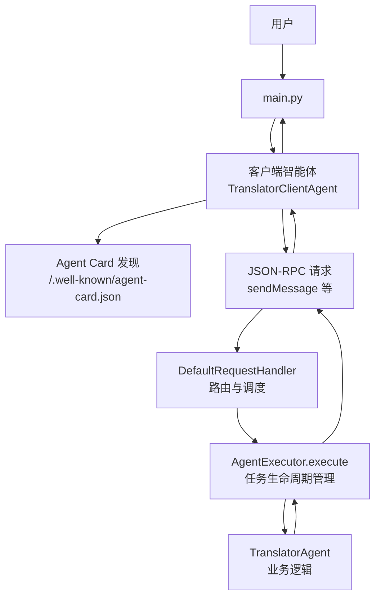
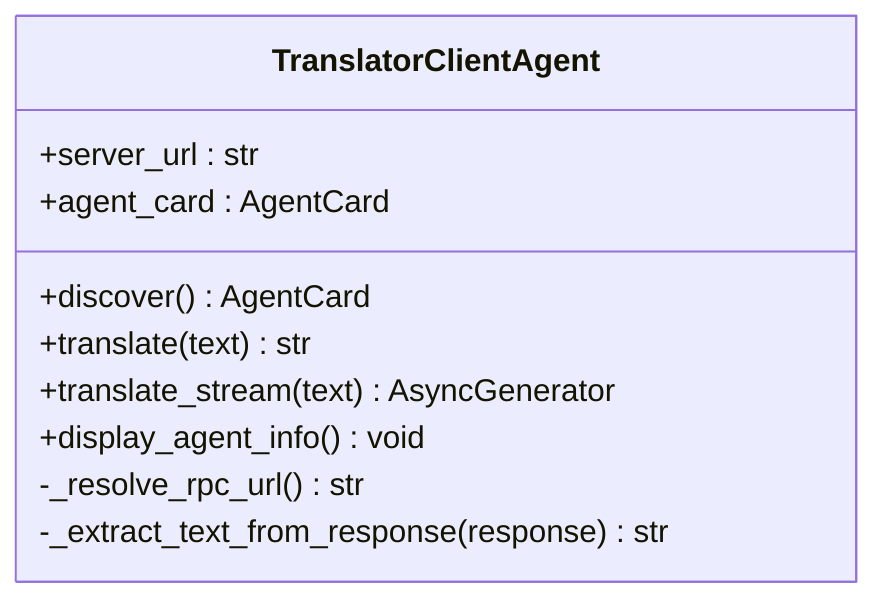
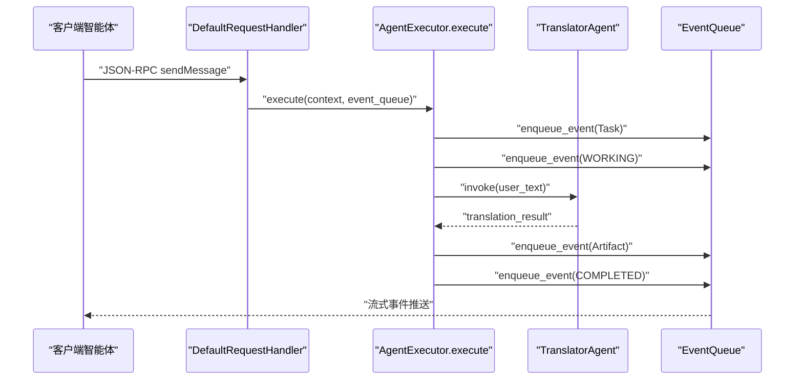
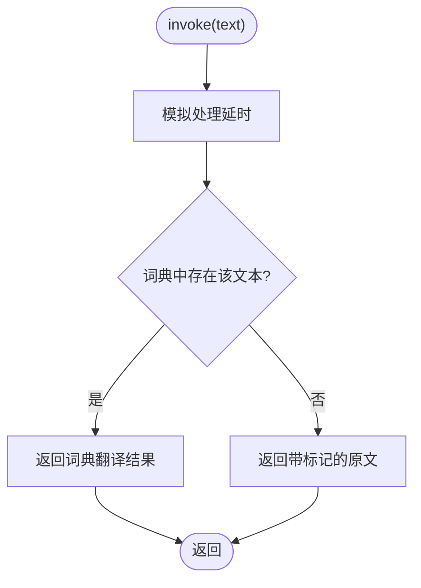
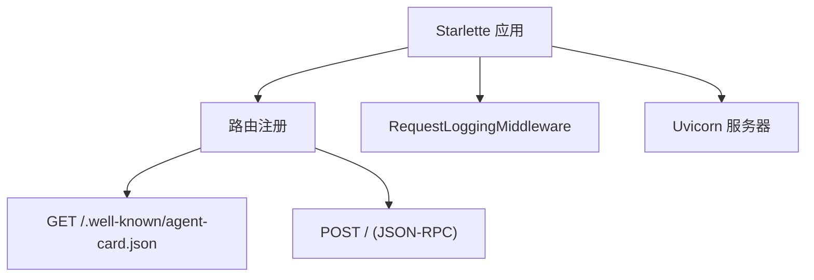
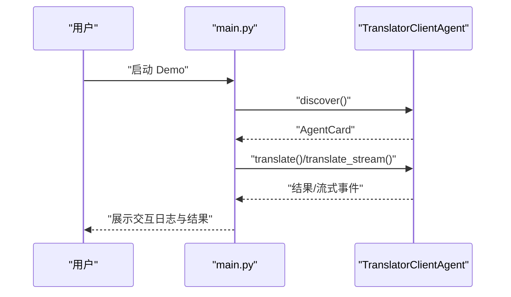
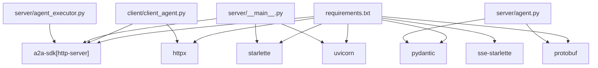

# 系统架构

<cite>
**本文引用的文件**
- [main.py](file://main.py)
- [client/client_agent.py](file://client/client_agent.py)
- [server/__main__.py](file://server/__main__.py)
- [server/agent_executor.py](file://server/agent_executor.py)
- [server/agent.py](file://server/agent.py)
- [requirements.txt](file://requirements.txt)
</cite>

## 目录
1. [引言](#引言)
2. [项目结构](#项目结构)
3. [核心组件](#核心组件)
4. [架构总览](#架构总览)
5. [详细组件分析](#详细组件分析)
6. [依赖关系分析](#依赖关系分析)
7. [性能考量](#性能考量)
8. [故障排查指南](#故障排查指南)
9. [结论](#结论)

## 引言
本系统围绕 A2A（Agent2Agent）协议构建了一个教学演示，完整展示三个核心角色的职责与交互：用户、客户端智能体（Client Agent）、服务器端执行器（Server Agent Executor）。系统通过 Agent Card 发现机制、JSON-RPC 请求/响应与流式传输，演示了任务生命周期（SUBMITTED → WORKING → Artifact 产出 → COMPLETED）的完整闭环。

## 项目结构
项目采用按角色分层的组织方式：
- 入口与演示：main.py
- 客户端智能体：client/client_agent.py
- 服务器端：server/__main__.py（启动与路由）、server/agent_executor.py（执行器）、server/agent.py（业务代理）

**图表来源**
- [main.py:43-184](file://main.py#L43-L184)
- [client/client_agent.py:30-274](file://client/client_agent.py#L30-L274)
- [server/__main__.py:83-171](file://server/__main__.py#L83-L171)
- [server/agent_executor.py:35-169](file://server/agent_executor.py#L35-L169)
- [server/agent.py:13-78](file://server/agent.py#L13-L78)

**章节来源**
- [main.py:1-185](file://main.py#L1-L185)
- [client/client_agent.py:1-274](file://client/client_agent.py#L1-L274)
- [server/__main__.py:1-176](file://server/__main__.py#L1-L176)
- [server/agent_executor.py:1-169](file://server/agent_executor.py#L1-L169)
- [server/agent.py:1-78](file://server/agent.py#L1-L78)

## 核心组件
- 用户（User）：通过 main.py 模拟发起翻译请求，驱动整个交互流程。
- 客户端智能体（Client Agent）：封装 Agent Card 发现、非流式与流式翻译请求，并解析 A2A 流式响应。
- 服务器端执行器（Server Agent Executor）：实现 A2A SDK 的 AgentExecutor 接口，协调任务生命周期与事件发布。
- 业务代理（TranslatorAgent）：承载具体翻译业务逻辑，支持同步与流式输出。

**章节来源**
- [main.py:43-184](file://main.py#L43-L184)
- [client/client_agent.py:30-274](file://client/client_agent.py#L30-L274)
- [server/agent_executor.py:35-169](file://server/agent_executor.py#L35-L169)
- [server/agent.py:13-78](file://server/agent.py#L13-L78)

## 架构总览
系统采用“客户端智能体 ↔ 服务器端执行器 ↔ 业务代理”的分层架构，配合 A2A 协议的 Agent Card 与 JSON-RPC 通道，实现任务的发现、请求、状态更新与产物交付。

**图表来源**
- [main.py:43-184](file://main.py#L43-L184)
- [client/client_agent.py:50-184](file://client/client_agent.py#L50-L184)
- [server/__main__.py:127-147](file://server/__main__.py#L127-L147)
- [server/agent_executor.py:45-161](file://server/agent_executor.py#L45-L161)
- [server/agent.py:34-77](file://server/agent.py#L34-L77)

## 详细组件分析

### 客户端智能体（TranslatorClientAgent）
职责与交互模式
- Agent 发现：通过 A2ACardResolver 获取 Agent Card，解析 supported_interfaces 中的 RPC 地址。
- 非流式翻译：创建 ClientConfig(streaming=False)，构造 SendMessageRequest，遍历 client.send_message 的响应流，提取最终文本结果。
- 流式翻译：创建 ClientConfig(streaming=True)，逐个 yield 流式 chunk，客户端负责解析 payload 类型（task/status_update/artifact_update/message）并展示状态变化。
- 结果解析：统一使用 WhichOneof("payload") 判断响应类型，从不同字段抽取文本内容。

**图表来源**
- [client/client_agent.py:30-274](file://client/client_agent.py#L30-L274)

**章节来源**
- [client/client_agent.py:50-184](file://client/client_agent.py#L50-L184)
- [client/client_agent.py:205-274](file://client/client_agent.py#L205-L274)

### 服务器端执行器（TranslatorAgentExecutor）
职责与交互模式
- 接收 RequestContext，创建或获取 Task，发布 SUBMITTED 事件。
- 将任务状态更新为 WORKING，发送状态更新事件。
- 从消息中提取用户文本，调用 TranslatorAgent.invoke 执行翻译。
- 发布 Artifact（翻译结果），最后将任务状态更新为 COMPLETED；异常时发布 FAILED 状态。
- 当前 Demo 不支持取消任务（cancel 未实现）。

**图表来源**
- [server/agent_executor.py:45-161](file://server/agent_executor.py#L45-L161)
- [server/agent.py:34-51](file://server/agent.py#L34-L51)

**章节来源**
- [server/agent_executor.py:35-169](file://server/agent_executor.py#L35-L169)

### 业务代理（TranslatorAgent）
职责与交互模式
- 同步翻译：模拟翻译处理延时后，从预设词典查找翻译结果，未命中则返回带标记的原文。
- 流式翻译：将翻译结果拆分为单词，逐词返回，模拟 LLM 逐 token 输出；当前 Demo 的执行器使用 invoke，stream 保留扩展。

**图表来源**
- [server/agent.py:34-51](file://server/agent.py#L34-L51)

**章节来源**
- [server/agent.py:13-78](file://server/agent.py#L13-L78)

### 服务器启动与路由（server/__main__.py）
职责与交互模式
- 定义 AgentSkill 与 AgentCard，声明支持的接口（JSONRPC）与能力（流式）。
- 配置 DefaultRequestHandler，绑定 TranslatorAgentExecutor 与 InMemoryTaskStore。
- 注册两类路由：Agent Card 路由（GET /.well-known/agent-card.json）与 JSON-RPC 路由（POST /）。
- 使用 Starlette + Uvicorn 启动 HTTP 服务器，内置请求/响应日志中间件。

**图表来源**
- [server/__main__.py:127-147](file://server/__main__.py#L127-L147)
- [server/__main__.py:44-80](file://server/__main__.py#L44-L80)

**章节来源**
- [server/__main__.py:83-171](file://server/__main__.py#L83-L171)

### 用户交互入口（main.py）
职责与交互模式
- 配置日志，降低第三方库噪声。
- 分三阶段演示：Agent 发现、非流式翻译、流式翻译。
- 展示角色标识与交互流程，解析流式响应中的 Task 生命周期状态。

**图表来源**
- [main.py:43-184](file://main.py#L43-L184)

**章节来源**
- [main.py:43-184](file://main.py#L43-L184)

## 依赖关系分析
技术栈与外部依赖
- a2a-sdk[http-server]：A2A 协议 SDK，提供 AgentCard 解析、ClientConfig、create_client、AgentExecutor、EventQueue 等核心能力。
- httpx：异步 HTTP 客户端，用于客户端智能体的 Agent Card 获取与 JSON-RPC 请求。
- starlette/uvicorn：Web 框架与 ASGI 服务器，提供路由与 HTTP 服务。
- pydantic/protobuf/sse-starlette：数据模型、序列化与 SSE 流式支持。

**图表来源**
- [requirements.txt:1-8](file://requirements.txt#L1-L8)
- [client/client_agent.py:18-25](file://client/client_agent.py#L18-L25)
- [server/__main__.py:22-34](file://server/__main__.py#L22-L34)
- [server/agent_executor.py:18-30](file://server/agent_executor.py#L18-L30)
- [server/agent.py:13-18](file://server/agent.py#L13-L18)

**章节来源**
- [requirements.txt:1-8](file://requirements.txt#L1-L8)

## 性能考量
- 异步与并发
  - 客户端智能体与服务器端均采用异步编程，减少阻塞，提升吞吐。
  - 服务器端使用 Uvicorn（ASGI）承载高并发请求。
- 流式传输
  - 服务器端声明 capabilities.streaming=True，客户端以 SSE 方式接收流式事件，降低首字节延迟。
- 任务状态与事件队列
  - 使用 EventQueue 顺序发布状态更新与 Artifact，保证客户端能逐步感知任务进展。
- 资源管理
  - 客户端在每次请求后主动关闭 client，避免连接泄漏。
- 日志与可观测性
  - 服务器端内置请求/响应中间件，记录请求方法、路径、耗时与响应状态，便于性能分析与问题定位。

[本节为通用性能指导，无需特定文件引用]

## 故障排查指南
常见问题与定位思路
- 无法发现 Agent Card
  - 确认服务器已启动且监听 127.0.0.1:9999。
  - 检查 Agent Card 路由是否可用：GET /.well-known/agent-card.json。
  - 关注客户端日志中“连接失败”提示与服务器端中间件日志。
- JSON-RPC 请求失败
  - 检查客户端 resolve 的 RPC URL 是否与 AgentCard 中 supported_interfaces 一致。
  - 关注服务器端中间件日志，查看请求体与响应状态码。
- 流式传输异常
  - 确认客户端以 ClientConfig(streaming=True) 初始化。
  - 检查流式事件解析逻辑，确保正确处理 payload 类型（task/status_update/artifact_update/message）。
- 任务状态异常
  - 若出现 FAILED，检查执行器中的异常分支与事件发布。
  - 关注执行器日志中“任务执行失败”的异常堆栈。

**章节来源**
- [client/client_agent.py:50-79](file://client/client_agent.py#L50-L79)
- [server/__main__.py:44-80](file://server/__main__.py#L44-L80)
- [server/agent_executor.py:147-161](file://server/agent_executor.py#L147-L161)

## 结论
本系统以 A2A 协议为核心，通过客户端智能体、服务器端执行器与业务代理的清晰分层，完整演示了 Agent 发现、任务生命周期与流式传输的关键机制。其架构具备良好的可扩展性：可替换业务代理、扩展多 Agent 协作、引入持久化任务存储与更复杂的事件编排。在性能方面，异步与 SSE 流式传输提供了较好的实时性与吞吐表现。