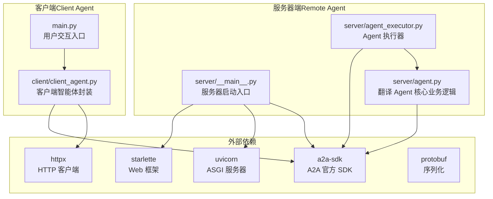
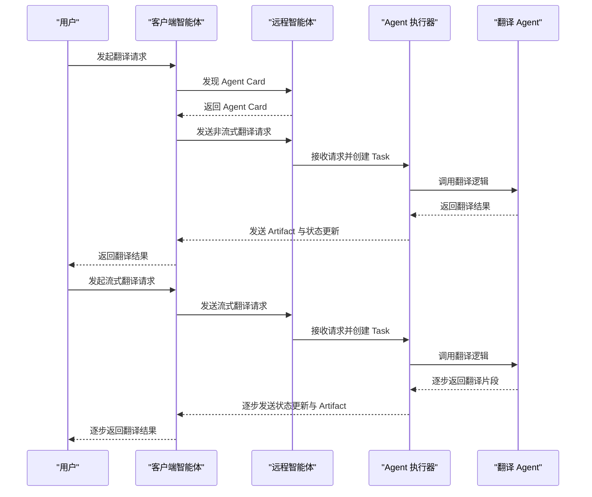
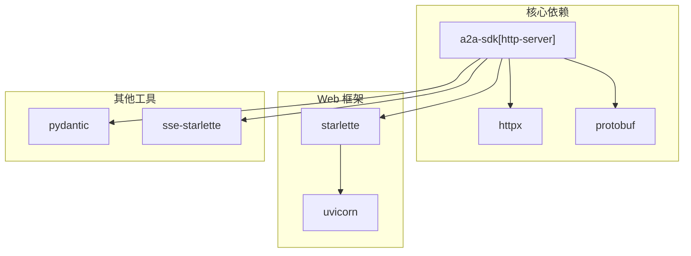

# 项目概述

<cite>
**本文档引用的文件**
- [README.md](file://README.md)
- [CLAUDE.md](file://CLAUDE.md)
- [main.py](file://main.py)
- [requirements.txt](file://requirements.txt)
- [client/client_agent.py](file://client/client_agent.py)
- [server/__main__.py](file://server/__main__.py)
- [server/agent_executor.py](file://server/agent_executor.py)
- [server/agent.py](file://server/agent.py)
</cite>

## 目录
1. [引言](#引言)
2. [项目结构](#项目结构)
3. [核心组件](#核心组件)
4. [架构总览](#架构总览)
5. [详细组件分析](#详细组件分析)
6. [依赖分析](#依赖分析)
7. [性能考虑](#性能考虑)
8. [故障排除指南](#故障排除指南)
9. [结论](#结论)
10. [附录](#附录)

## 引言

本项目是一个基于 A2A（Agent2Agent）官方 SDK 的完整教程演示案例，旨在帮助开发者深入理解 A2A 协议的工作原理与实践方法。A2A 协议由 Google Cloud 发起，是一种开放协议，旨在让不同 AI Agent 之间实现标准化通信与协作。该项目通过一个完整的闭环交互流程，清晰地展示了三个核心角色之间的协作关系：用户（User）、客户端智能体（Client Agent）和远程智能体（Remote Agent），并通过一个简单的中文到英文翻译场景，演示了 A2A 协议的典型应用模式。

本教程 Demo 的核心价值在于：
- **教学演示性质**：通过可视化的日志输出和分阶段的交互流程，帮助初学者理解 A2A 协议的三大核心概念：Agent Card、Task 和流式传输。
- **完整闭环流程**：从 Agent 发现、非流式翻译请求，到流式翻译请求，覆盖了 A2A 协议的主要交互模式。
- **可扩展性示范**：项目结构清晰，便于开发者在此基础上扩展更复杂的业务逻辑，如接入 LLM 或翻译 API。

学习目标包括：
- 理解 A2A 协议的基本概念与三个核心角色的职责分工
- 掌握 Agent Card 的作用与获取方式
- 理解 Task 的生命周期及其在协议中的核心地位
- 学会使用 A2A SDK 进行客户端与远程智能体的交互
- 了解流式传输在 A2A 协议中的应用与实现方式

## 项目结构

项目采用分层设计，分为客户端（Client Agent）与服务器端（Remote Agent）两大部分，配合用户交互入口，形成完整的教学演示闭环。

图表来源
- [main.py:1-185](file://main.py#L1-L185)
- [client/client_agent.py:1-274](file://client/client_agent.py#L1-L274)
- [server/__main__.py:1-176](file://server/__main__.py#L1-L176)
- [server/agent_executor.py:1-169](file://server/agent_executor.py#L1-L169)
- [server/agent.py:1-78](file://server/agent.py#L1-L78)

章节来源
- [README.md:28-43](file://README.md#L28-L43)
- [CLAUDE.md:22-33](file://CLAUDE.md#L22-L33)

## 核心组件

本项目围绕三个核心角色展开：
- **用户（User）**：通过用户交互入口发起翻译请求，观察整个闭环流程。
- **客户端智能体（Client Agent）**：负责发现远程 Agent、构建请求、发送消息并解析响应，支持非流式与流式两种交互模式。
- **远程智能体（Remote Agent）**：提供翻译能力，通过 Agent Card 声明自身能力，通过 AgentExecutor 处理请求并返回结果，支持流式与非流式两种输出。

关键概念与职责：
- **Agent Card**：远程智能体的身份名片，声明其名称、描述、版本、支持的接口与技能列表，客户端通过标准路径获取。
- **AgentSkill**：具体技能描述，包含技能 ID、名称、描述、标签与示例输入，帮助客户端选择合适的 Agent。
- **Task**：A2A 交互的核心单元，具有完整的生命周期（SUBMITTED → WORKING → Artifact 产出 → COMPLETED 或 FAILED）。
- **Message/Part**：Agent 间的通信消息格式，支持文本等多种内容类型。
- **Artifact**：Agent 执行任务后的产物，通常为翻译结果或其他业务数据。
- **AgentExecutor**：SDK 的核心接口，连接协议层与业务逻辑层，负责处理请求、管理 Task 生命周期并发出状态与产物事件。

章节来源
- [README.md:81-91](file://README.md#L81-L91)
- [CLAUDE.md:35-42](file://CLAUDE.md#L35-L42)

## 架构总览

下图展示了 A2A 协议在本项目中的整体架构与交互流程，从用户发起请求到最终返回结果的完整闭环。

图表来源
- [main.py:43-180](file://main.py#L43-L180)
- [client/client_agent.py:50-184](file://client/client_agent.py#L50-L184)
- [server/__main__.py:83-171](file://server/__main__.py#L83-L171)
- [server/agent_executor.py:45-161](file://server/agent_executor.py#L45-L161)
- [server/agent.py:34-78](file://server/agent.py#L34-L78)

## 详细组件分析

### 用户交互入口（main.py）

用户交互入口负责演示完整的 A2A 协议闭环流程，包含三个阶段：
- **阶段 1：Agent 发现（Discovery）**：客户端通过标准路径获取远程 Agent 的 Agent Card，了解其能力与接口。
- **阶段 2：非流式翻译请求**：客户端向远程 Agent 发送翻译请求，等待完整结果返回。
- **阶段 3：流式翻译请求**：客户端以流式方式接收翻译结果，展示 Task 生命周期与实时传输效果。

该模块还提供了丰富的日志输出，帮助学习者理解每一步的交互细节与协议行为。

章节来源
- [main.py:43-180](file://main.py#L43-L180)

### 客户端智能体（client/client_agent.py）

客户端智能体封装了与远程智能体交互的全部逻辑，主要职责包括：
- **Agent 发现**：通过 A2ACardResolver 获取 Agent Card，解析其支持的接口与技能。
- **非流式翻译**：创建非流式客户端，发送翻译请求并解析返回的完整结果。
- **流式翻译**：创建流式客户端，逐步接收翻译结果，展示 Task 的状态更新与 Artifact 到达事件。

该模块还实现了对 StreamResponse 的解析，支持从 oneof payload 中提取任务状态、消息内容与产物信息。

章节来源
- [client/client_agent.py:30-274](file://client/client_agent.py#L30-L274)

### 服务器端启动入口（server/__main__.py）

服务器端启动入口负责：
- **定义 Agent 技能（AgentSkill）**：声明翻译能力与示例输入。
- **创建 Agent 名片（AgentCard）**：声明 Agent 的基本信息、能力与支持的接口。
- **配置请求处理器与路由**：注册 Agent Card 路由与 JSON-RPC 路由，启动 HTTP 服务器。
- **启动日志中间件**：记录每个 HTTP 请求与响应的详细信息，便于学习理解底层通信。

章节来源
- [server/__main__.py:83-171](file://server/__main__.py#L83-L171)

### Agent 执行器（server/agent_executor.py）

Agent 执行器实现了 A2A SDK 的 AgentExecutor 接口，负责：
- **接收请求上下文**：从 RequestContext 中提取用户消息与任务信息。
- **管理 Task 生命周期**：创建 Task → 更新状态为 WORKING → 调用业务逻辑 → 发送 Artifact → 更新状态为 COMPLETED。
- **事件队列管理**：通过 EventQueue 发送状态更新与产物事件，支持流式传输。

该模块完整展示了 Task 的生命周期与事件驱动的交互模式。

章节来源
- [server/agent_executor.py:35-169](file://server/agent_executor.py#L35-L169)

### 翻译 Agent 核心业务逻辑（server/agent.py）

翻译 Agent 是服务器端的“大脑”，负责实际的翻译业务处理：
- **invoke 方法**：同步翻译，接收中文文本并返回完整英文翻译结果，模拟异步处理延迟。
- **stream 方法**：流式翻译，逐词返回翻译结果，展示如何实现流式业务逻辑。

该模块使用预设词典进行模拟翻译，便于演示协议流程而不依赖外部服务。

章节来源
- [server/agent.py:13-78](file://server/agent.py#L13-L78)

## 依赖分析

项目依赖主要围绕 A2A 官方 SDK 与常见的 Python Web 技术栈展开，确保协议实现与服务器端功能的稳定运行。

图表来源
- [requirements.txt:1-8](file://requirements.txt#L1-L8)

章节来源
- [requirements.txt:1-8](file://requirements.txt#L1-L8)
- [CLAUDE.md:44-47](file://CLAUDE.md#L44-L47)

## 性能考虑

- **异步处理**：客户端与服务器端均采用异步编程模型，提升并发处理能力与响应速度。
- **流式传输**：通过 SSE（Server-Sent Events）实现流式传输，减少等待时间，提升用户体验。
- **日志优化**：通过调整第三方库的日志级别，避免过多日志干扰，便于聚焦关键信息。
- **内存任务存储**：在演示环境中使用内存任务存储，简化部署；在生产环境中建议使用持久化存储方案。

## 故障排除指南

常见问题与解决方案：
- **服务器未启动**：确保先启动服务器再运行客户端，否则客户端将无法连接到远程智能体。
- **网络连接异常**：检查本地回环地址与端口是否正确，确认防火墙设置允许本地连接。
- **依赖安装问题**：确保 Python 版本满足要求，使用虚拟环境安装依赖，避免版本冲突。
- **流式传输中断**：检查客户端与服务器端的日志，确认事件队列与 SSE 配置正常。

章节来源
- [main.py:73-79](file://main.py#L73-L79)
- [server/__main__.py:152-158](file://server/__main__.py#L152-L158)

## 结论

本 A2A 协议教程 Demo 项目通过清晰的分层设计与完整的闭环流程，有效地展示了 A2A 协议在实际应用中的工作原理。通过对 Agent Card、Task 生命周期与流式传输的深入演示，开发者可以快速掌握 A2A 协议的核心概念与实践方法。项目结构清晰、依赖明确，适合进一步扩展为更复杂的业务场景，如接入 LLM 或翻译 API，从而实现更强大的智能体协作能力。

## 附录

### 快速开始指南

- **安装依赖**：激活虚拟环境并安装项目依赖。
- **启动服务器**：运行服务器启动入口，等待服务启动完成。
- **运行客户端**：在另一个终端中运行用户交互入口，观察完整的闭环流程。

章节来源
- [README.md:45-79](file://README.md#L45-L79)

### 学习路径建议

- **前置知识**：了解 Python 异步编程、HTTP 协议与 REST API 基础。
- **进阶方向**：学习 A2A 协议规范、事件驱动架构与流式传输技术。
- **实践扩展**：尝试接入真实的大语言模型或翻译服务，实现更复杂的业务逻辑。

章节来源
- [README.md:81-107](file://README.md#L81-L107)
- [CLAUDE.md:35-42](file://CLAUDE.md#L35-L42)